# Cross-Module Map — Auth Module

## Dependency Graph

```mermaid
graph TD
    subgraph auth["lib/features/auth/"]
        LoginScreen
        OtpScreen
        RegistrationScreen
        EmailOtpSheet
        RegistrationSuccessScreen
        PinCreationScreen
        PinScreen
        AuthController
    end

    subgraph core_services["lib/core/services/"]
        AuthService
        AuthNotifier
        MpinService
        DeviceIdService
        FcmService
        NotificationService
        SharedService
        EnvironmentService
    end

    subgraph core_security["lib/core/security/"]
        ApiInterceptor["ApiSecurityInterceptor"]
        EncryptionService
        SecureStorageService
        SessionManager
        ScreenshotSecurityService
        CertificatePinning
    end

    subgraph core_network["lib/core/network/"]
        ApiClient
    end

    subgraph core_utils["lib/core/utils/"]
        Validators
        MaskingUtils
        NavigationUtils
    end

    subgraph core_providers["lib/core/providers/"]
        AppControlProvider
        EnvironmentProvider
        CommodityProvider
    end

    subgraph shared["lib/shared/"]
        CustomButton
        AppToast
        SecureClipboard
        Animations
        AppTheme
    end

    subgraph other_features["other feature modules"]
        MpinScreen["features/mpin/mpin_screen.dart"]
        HomeMain["features/main (home shell)"]
    end

    AuthController -->|extends| AuthNotifier
    AuthController -->|new MpinService| MpinService
    LoginScreen --> AuthController
    LoginScreen --> Validators
    LoginScreen --> SharedService
    LoginScreen --> AppControlProvider
    LoginScreen --> EnvironmentProvider
    OtpScreen --> AuthController
    OtpScreen --> ScreenshotSecurityService
    OtpScreen --> MaskingUtils
    OtpScreen --> NavigationUtils
    OtpScreen --> SecureStorageService
    RegistrationScreen --> AuthController
    RegistrationScreen -->|reads authServiceProvider directly| AuthService
    RegistrationScreen --> Validators
    RegistrationScreen --> EmailOtpSheet
    EmailOtpSheet --> AuthController
    EmailOtpSheet --> MaskingUtils
    PinCreationScreen --> AuthController
    PinCreationScreen --> FcmService
    PinCreationScreen --> NotificationService
    PinCreationScreen --> SecureStorageService
    PinScreen --> AuthController
    PinScreen --> NavigationUtils

    AuthNotifier --> AuthService
    AuthService --> ApiClient
    MpinService --> ApiClient
    FcmService --> NotificationService
    NotificationService --> ApiClient
    NotificationService --> DeviceIdService
    NotificationService --> SecureStorageService
    ApiClient --> ApiInterceptor
    ApiInterceptor --> EncryptionService
    ApiInterceptor --> SecureStorageService
    ApiInterceptor --> SessionManager
    ApiInterceptor --> CertificatePinning
    EncryptionService --> SecureStorageService

    all_screens["all 6 screens"] -.->|shared widgets| CustomButton
    all_screens -.-> AppToast
    all_screens -.-> SecureClipboard
    all_screens -.-> Animations

    OtpScreen -->|pushReplacementNamed AppRouter.mpin| MpinScreen
    PinScreen -->|pushNamedAndRemoveUntil AppRouter.home| HomeMain
    PinCreationScreen -->|pushNamedAndRemoveUntil AppRouter.home| HomeMain
    RegistrationSuccessScreen -->|pushNamedAndRemoveUntil AppRouter.home| HomeMain
```

## Core Dependencies (detail)

| `core/` file | Used for | Auth call sites |
|---|---|---|
| `core/services/auth_service.dart` | **This is where most of the module's real logic lives** — `AuthService` (HTTP calls) + `AuthNotifier` (state, base of `AuthController`) | all auth screens, indirectly |
| `core/services/mpin_service.dart` | PIN create/verify HTTP + `MpinNotifier` (not used by this module — auth's `AuthController` calls `MpinService` directly, bypassing `MpinNotifier`/`mpinProvider`) | `auth_controller.dart:12-13, 30-31` |
| `core/services/device_id_service.dart` | Stable device ID + type + metadata, sent on `generate-otp`, `register`, `register-check`, FCM registration | `auth_service.dart:39-40, 145-146, 195-196`; `notification_service.dart:124-126` |
| `core/services/fcm_service.dart` | Device push token retrieval | `pin_creation_screen.dart:471` |
| `core/services/notification_service.dart` | FCM token registration endpoint + dedup | `pin_creation_screen.dart:473` |
| `core/services/shared_service.dart` | Country-code dropdown data (`countryCodesProvider`) | `login_screen.dart:68-78, 87, 275-287` |
| `core/services/environment_service.dart` | Dev-only staging/production API switcher (hidden UI in `LoginScreen`) | `login_screen.dart:22, 667-701` |
| `core/security/api_interceptor.dart` | RSA field encryption gate, auth header injection, 401 refresh, 409 force-logout | every API call this module makes, transparently |
| `core/security/encryption_service.dart` | RSA-OAEP-SHA256 encrypt of sensitive fields | invoked by the interceptor, not directly by auth screens |
| `core/security/secure_storage_service.dart` | Token/refresh-token/mpin-flag/customer-id/name/photo/mobile/FCM-token persistence | `auth_service.dart` (post verify-otp, post register), `pin_creation_screen.dart:436`, `otp_screen.dart:208` (logout on forgot-pin edit) |
| `core/security/session_manager.dart` | `isAuthenticated()`, `resetForceLogout()` | `auth_service.dart:75` (reset on fresh login), `navigation_utils.dart:37` (fallback routing) |
| `core/security/screenshot_security_service.dart` | FLAG_SECURE / blur toggle | `otp_screen.dart:56-62` only |
| `core/network/api_client.dart` | Single Dio instance, all HTTP | `auth_service.dart`, `mpin_service.dart`, `notification_service.dart`, `shared_service.dart` |
| `core/utils/validators.dart` | Mobile/OTP/email format checks | `login_screen.dart:90`, `registration_screen.dart:299, 481` (email only — `validateOTP` defined but not called anywhere in this module; OTP completeness is checked via `.length == 6` directly, e.g. `otp_screen.dart:358`) |
| `core/utils/masking_utils.dart` | Display-only mobile/email masking | `otp_screen.dart:197`, `email_otp_sheet.dart:161` |
| `core/utils/navigation_utils.dart` | `safePop` with auth-aware fallback | `otp_screen.dart:147, 219`, `registration_screen.dart:147`, `pin_creation_screen.dart:166`, `pin_screen.dart:87` |
| `core/providers/app_control_provider.dart` | `dynamicSwitching` flag + password gating the hidden env-switcher dialog | `login_screen.dart:229-233` |
| `core/providers/environment_provider.dart` | Current environment (staging/production) state | `login_screen.dart:629, 668-701` |
| `core/localization/language_provider.dart` | `ref.tr(...)` translated strings | `pin_screen.dart:93, 104, 152` only (other auth screens use hardcoded English strings — inconsistent i18n coverage within the module) |
| `main.dart` (`navigatorKey`) | Global navigator access outside widget context | `login_screen.dart:13, 513` |
| `routes/app_router.dart` | Central route registry + argument parsing for every route this module owns | see MODULE_BRAIN.md §3 |

## Handoffs to Other Feature Modules

- **→ `mpin` module** (`lib/features/mpin/mpin_screen.dart`): the primary handoff. `OtpScreen` pushes
  `AppRouter.mpin` for 3 of its 5 routing branches (returning user w/ PIN, returning user w/o PIN → setup
  mode, forgot-PIN → reset mode) — see MODULE_BRAIN.md §5. **No Dart import** from `auth/` into `mpin/` exists
  — the handoff is purely via named route + a `Map<String, dynamic>` arguments contract
  (`type`/`temp_token`/`mobile`/`from_app_lock` keys). This module was **not** built in this round — its
  brain does not yet exist (`knowledge_brain/MPIN/` — unconfirmed contents); the argument contract documented
  here should be cross-checked against `mpin_screen.dart`'s actual `ModalRoute.of(context)!.settings.arguments`
  parsing when that module's brain is built, to confirm no drift in the shared arg-map shape.
- **→ `kyc` module**: **no reference found**. Grepped `lib/features/auth/` for `kyc`/`Kyc` — zero matches.
  KYC is not part of this module's own flow; it's presumably initiated later from `home`/`profile` after
  first login. The task brief's expectation of an auth→kyc handoff does **not** hold in the current codebase
  — flagged as a documentation-expectation mismatch, not a code bug.
- **→ `home`/`main` module**: 3 auth screens terminate the flow with `pushNamedAndRemoveUntil(AppRouter.home,
  ...)` — `PinScreen` (line 197-198), `PinCreationScreen` (line 449-451, no-fullName branch),
  `RegistrationSuccessScreen` (line 169-173, "Get Started" button). This clears the entire back-stack so the
  user can never navigate back into the auth flow post-login.

## Known Layering Notes

- `RegistrationScreen` reads `authServiceProvider` (the raw service, no Riverpod loading/error state)
  directly for `registerCheck` instead of going through `AuthController`/`AuthNotifier`
  (`registration_screen.dart:531`) — a deliberate deviation from AGENTS.md §1's `Screen → Controller →
  Service` layering, using its own local `_isSubmitting` bool instead. Not necessarily a bug, but any future
  refactor should preserve the distinct loading-state semantics this creates (register-check errors don't
  touch `AuthState.error`, so they don't collide with the `ref.listen<AuthState>` toast at the top of
  `build()`).
- `AuthController` (this module) calls `MpinService` directly rather than delegating to the `mpin` module's
  own `MpinNotifier`/`mpinProvider` (`core/services/mpin_service.dart:149-323`) — two independent Riverpod
  state trees exist for MPIN operations (`authControllerProvider.state` vs `mpinProvider.state`), which do
  not stay in sync with each other. A screen watching `mpinProvider` would not see loading/error state set by
  `AuthController.setPin`/`verifyPin`, and vice versa.
