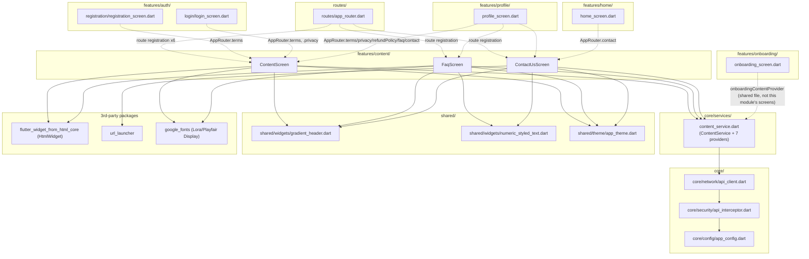

# Content — Cross-Module Map

## Dependency Graph

## Inbound Dependencies (who depends on Content)

| Caller | What it uses | File:Line |
|---|---|---|
| `features/auth/registration/registration_screen.dart` | `AppRouter.terms` (terms-acceptance link) | `registration_screen.dart:52` |
| `features/auth/login/login_screen.dart` | `AppRouter.terms`, `AppRouter.privacy` | `login_screen.dart:47, 50` |
| `features/profile/profile_screen.dart` | `AppRouter.terms`, `.privacy`, `.refundPolicy`, `.faq`, `.contact` (side-menu items) | `profile_screen.dart:265-295` |
| `features/home/home_screen.dart` | `AppRouter.contact` | `home_screen.dart:927` |
| `features/onboarding/onboarding_screen.dart` | `onboardingContentProvider` (from `content_service.dart`, **not** from `features/content/` screens) | `onboarding_screen.dart:25, 124` |
| `routes/app_router.dart` | Route registration for all 6 content-surface routes | `app_router.dart:261-274, 357-360` |

## Outbound Dependencies (what Content depends on)

| Dependency | Purpose |
|---|---|
| `core/services/content_service.dart` (`ContentService` + providers) | Entire data layer — lives in `core/`, shared with `onboarding` |
| `core/network/api_client.dart` (`ApiClient`) | All HTTP (via `ContentService`) |
| `core/security/api_interceptor.dart` (indirect) | Bearer token attach; encryption gate not triggered (`content/*` absent from `encryptedEndpoints`) |
| `flutter_widget_from_html_core` (`HtmlWidget`) | HTML content rendering — `ContentScreen`, `FaqScreen` answers |
| `url_launcher` | `mailto:`/`tel:`/`https://wa.me/`/social URLs — `ContactUsScreen` only |
| `google_fonts` | Playfair Display (body) / Lora (numerics) typography |
| `shared/widgets/gradient_header.dart` | Header UI on all 3 screens |
| `shared/widgets/numeric_styled_text.dart` | Non-HTML numeric/text font-splitting (FAQ questions, contact card values) |
| `shared/theme/app_theme.dart` | Color/gradient constants |
| `routes/app_router.dart` | Route constants, `ContentScreen`'s `title`/`provider` wiring |

## Known Layering Violations

None. `features/content/` screens correctly go through `core/services/content_service.dart` rather than
calling `ApiClient` directly, per `AGENTS.md` §1. The one structural oddity — `content_service.dart` living
in `core/services/` rather than a `features/content/services/` folder — is itself the correct pattern per
`AGENTS.md` §1 ("cross-feature reuse goes through ... `lib/core/`"), since `onboarding` also depends on it.

## Notes for `_SYSTEM/MODULE_DEPENDENCIES.md` synthesis

- `Content` and `Onboarding` share a single `core/` service file — any change to
  `core/services/content_service.dart` (e.g. changing `_extractContentMap`'s tolerated response shapes)
  must be re-verified against **both** modules' brains, not just `Content`'s.
- `Content` is otherwise a near-leaf module like `Support` — nothing in `core/` or other features imports
  from `features/content/` itself (only from the shared `core/services/content_service.dart`).
- Two of six routes owned by this module's rendering surface (`/about`) and the sibling `Support` module's
  (`/support`) share the exact same "registered but unreachable" pattern — worth flagging as a systemic
  code-smell (dead routes left over from a redesign) if `_SYSTEM/DANGER_ZONES.md` tracks that kind of thing.
