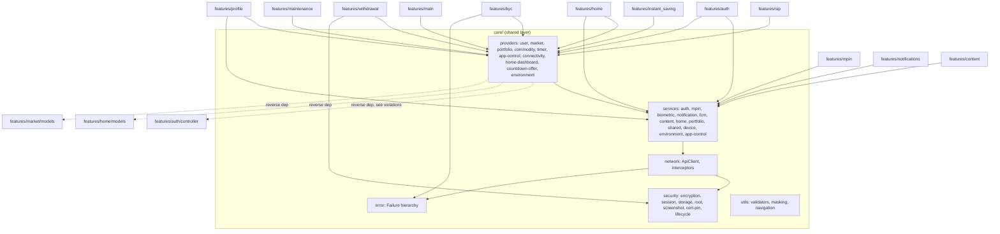

# Core — Cross-Module Map

`core/` is depended **on** by all 23 feature modules (it has no feature-module dependencies going the other
direction in the normal case — see "Known Violations" for the exceptions). This doc inverts the usual
`CROSS_MODULE_MAP.md` direction: instead of "what does this module depend on," it's "who consumes this
module," gathered via `grep -rlE "core/(providers|services|security|network)" lib/features/*/`.

## Consumer Density by Feature (files importing `core/providers|services|security|network`)

| Feature | Files importing core | Notes |
|---|---|---|
| `profile` | 10 | heaviest consumer — user data, bank verification |
| `auth` | 6 | login/OTP/registration against `AuthService`/`AuthNotifier` |
| `instant_saving` | 7 | timer, market, user, commodity, countdown-offer providers |
| `sip` | 7 | user provider, market provider |
| `withdrawal` | 5 | commodity, market, user, timer providers — heaviest *provider* consumer |
| `content` | 2 | `ContentService`/`*Provider` (terms/privacy/FAQ/about/contact/refund) |
| `history` | 2 | user provider |
| `home` | 2 | market/commodity/portfolio/user/home-dashboard/countdown-offer/timer — dense single-screen import list |
| `kyc` | 2 | user provider, `KycRequiredFailure` |
| `mpin` | 2 | `MpinService`/`MpinNotifier` |
| `nominee` | 2 | not traced further this pass |
| `referral` | 2 | not traced further this pass |
| `invoice` | 1 | not traced further this pass |
| `jewellery` | 1 | not traced further this pass |
| `main` | 1 | home-dashboard, portfolio providers (bottom-nav shell) |
| `maintenance` | 1 | `appControlProvider` |
| `notifications` | 1 | `NotificationService`/`NotificationNotifier` |
| `onboarding` | 1 | not traced further this pass |
| `settings` | 1 | not traced further this pass |
| `splash` | 1 | not traced further this pass |
| `support` | 1 | FAQ content |
| `daily_savings` | 0 | no direct `core/` import found this pass — verify if intentional (may go through `sip`/`instant_saving` shared services) |
| `market` | 0 | ironically the `market` **feature** folder only supplies `MarketRates`/model classes consumed *by* `core/`; it does not itself import `core/` |

## Provider-Level Consumers (confirmed via `core/providers/*` import grep)

| Provider | Confirmed feature consumers |
|---|---|
| `userProvider` | `home`, `kyc` (`kyc_controller.dart`), `withdrawal` (`withdrawal_service.dart`, screens), `history`, `profile`, `sip` (`sip_payment_screen.dart`), `instant_saving` (`payment_handler.dart`, `razorpay_payment_handler.dart`, `payment_methods_screen.dart`, `instant_saving_screen.dart`) |
| `marketRatesStreamProvider` / `market_provider.dart` exports | `home`, `withdrawal` (multiple screens), `instant_saving`, `sip` (`auto_savings_screen.dart`) |
| `commodityProvider`/`selectedMetalIdProvider` | `home`, `withdrawal`, `instant_saving` |
| `portfolioProvider` | `home`, `main`, `withdrawal` (`withdrawal_success_screen.dart`) |
| `homeDashboardProvider` | `home`, `main`, `withdrawal` (`withdrawal_success_screen.dart`), `instant_saving` (`purchase_success_screen.dart`) |
| `countdownOfferProvider` | `home` (`home_screen.dart`, `countdown_offer_widget.dart`), `instant_saving` |
| `sellRateTimerProvider`/`buyRateTimerProvider` | `withdrawal`, `instant_saving` |
| `appControlProvider` | `maintenance`, `auth` (`login_screen.dart`) |
| `environmentProvider` | `auth` (`login_screen.dart`) — environment switcher UI |

## Mermaid — Core as Shared Dependency

## Known Violations (AGENTS.md §1: "never import one feature's internals directly from another feature" — applied one layer up)

`core/` is supposed to be the thing features depend on, not the other way around. Four confirmed reverse
dependencies found by reading every import in `core/`:

1. **`core/providers/user_provider.dart:2`** imports `features/auth/controller/auth_controller.dart` and
   watches `authControllerProvider` (`:29`) — the app-wide user identity provider is downstream of a
   feature-owned controller. `AuthController extends AuthNotifier` (the core class in
   `core/services/auth_service.dart`), so the coupling is real but not accidental — it appears to be a
   deliberate choice to let the feature layer add `setPin`/`verifyPin` on top of the core `AuthNotifier`
   without duplicating state. Still means `core/` cannot be reasoned about, or refactored, without also
   reading `features/auth/controller/auth_controller.dart`.
2. **`core/providers/market_provider.dart:3`** and **`core/network/native_socket_service.dart:3`** import
   `features/market/models/market_rates.dart` (`MarketRates`) — the shared live-rate model lives under a
   feature folder despite being core network-layer infrastructure consumed by every commodity-facing screen.
3. **`core/providers/home_dashboard_provider.dart:3`** imports `features/home/models/home_dashboard.dart`;
   **`core/providers/countdown_offer_provider.dart:3`** and **`core/services/home_service.dart:2-3`** import
   `features/home/models/countdown_offer_model.dart` and `home_dashboard.dart` — same pattern, `home`'s
   response models are core-provider return types.
4. Net effect: a change to `features/home/models/*.dart` or `features/market/models/market_rates.dart` or
   `features/auth/controller/auth_controller.dart` can break `core/` compilation or runtime behavior with no
   warning from anywhere inside `core/` itself. Recommend (not executed this round, documentation only):
   promote `MarketRates`, `HomeDashboard`, `CountdownOfferResponse` to `core/models/` in a future refactor, and
   resolve the `userProvider` → `authControllerProvider` inversion by deciding whether `AuthController`'s
   extra methods (`setPin`/`verifyPin`) belong in `core/services/auth_service.dart` directly.

## Consumers Not Verified This Round

`daily_savings`, `nominee`, `referral`, `invoice`, `jewellery`, `onboarding`, `settings`, `splash` were only
checked at the "does this feature import core/ at all" level (file-count grep), not method-by-method. If a
future task touches `core/` and one of these features is in scope, re-grep before assuming the table above is
exhaustive for that feature.
