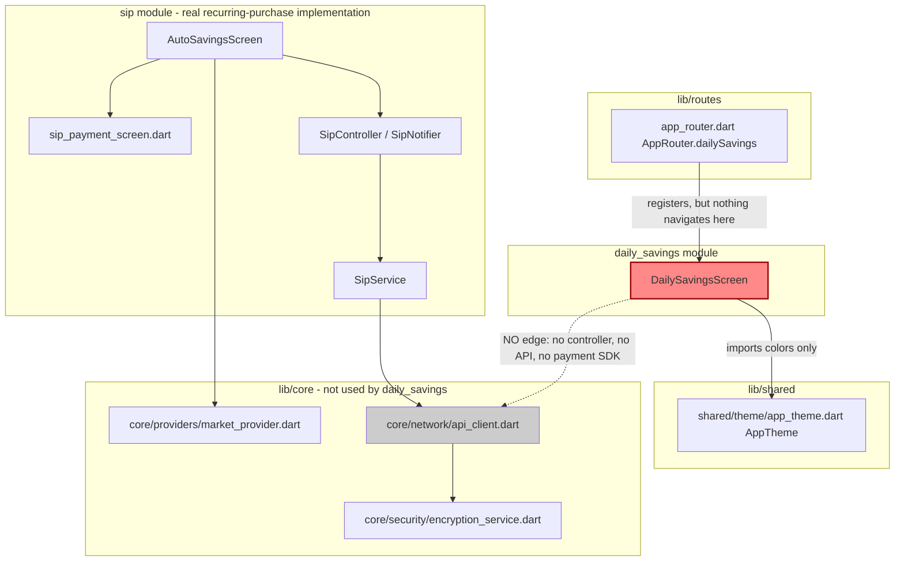

# DailySavings — Cross-Module Map

## 0. The `daily_savings` vs `sip` distinction (headline finding)

**Both modules' names suggest "recurring investment," and product copy in `daily_savings`
("Set a small amount to save daily") sounds identical to SIP's Daily frequency. Verified against
code, the actual relationship is: `daily_savings` is a disconnected, non-functional UI prototype
for a concept that was subsequently built for real inside `sip` as one of its three frequency
options.**

| Aspect | `daily_savings` module | `sip` module — Daily frequency |
|---|---|---|
| Screen | `daily_savings_screen.dart` (only file in module) | `sip/screens/auto_savings_screen.dart` (`AutoSavingsScreen`), one of 3 frequency tabs |
| State mgmt | Plain `setState`, local `String _selectedAmount` | Riverpod `sipControllerProvider` (`SipNotifier`/`SipState`, `sip_controller.dart:77,147`) + `sipConfigProvider`, `sipDetailsProvider`, denomination providers |
| Amount source | Hardcoded literals `₹10/₹20/₹50/₹100` in the widget | Backend-driven denominations (`SipService.getGoldDenominations`/`getSilverDenominations`, `sip_service.dart:28-54`), seeded from `sipGoldDenominationsProvider`/`sipSilverDenominationsProvider` |
| Frequency choice | None — screen title says "Daily" but there is no frequency selector at all | Explicit Daily/Weekly/Monthly tabs (`auto_savings_screen.dart` frequency-tab UI ~`:570-620`), backend `frequencyId: 1/2/3` (`sip_service.dart:59`) |
| Commodity choice | None (gold implied by app branding only) | Explicit gold/silver radio (`_buildInvestTypeRadio`, referenced `auto_savings_screen.dart:299`) |
| Plan creation API | **None** | `SipService.createSip(...)` → `sip/*` endpoints (`sip_service.dart:62` onward) |
| Payment gateway | **None invoked** — CTA is `onPressed: () {}` (`daily_savings_screen.dart:90`) | Real hand-off to `sip_payment_screen.dart` |
| Duplicate-plan guard | None | `SipState.hasActivePlanForFrequency(...)` prevents 2 active plans per frequency+commodity (`auto_savings_screen.dart:203-205, 262-265`) |
| Market-closed guard | None | Amber banner reading live `marketStatusProvider` socket data (`auto_savings_screen.dart:87-95, 144-173`) |
| Custom dates (non-Daily/Weekly/Monthly cadence) | N/A | Separate "Custom SIP" product via `custom_sip_service.dart`, `manage_custom_savings_screen.dart` |
| Reachability | Route registered but never navigated to from any in-app UI (dead route) | Reachable through the normal SIP entry points (Home/Main tab — not independently re-verified in this pass, out of scope for `daily_savings` brain) |

**Conclusion for whoever builds the SIP module brain next**: do not treat `daily_savings` as a
sibling/competing product to document separately from SIP's Daily frequency — in the shipped app
they are the same *concept*, but only the `sip` implementation is real. If product intends
`daily_savings` to become a genuinely distinct, simpler product (e.g. fixed ₹10/20/50/100 tiers
with no frequency/commodity choice, positioned as a lighter-weight onboarding flow before a user
graduates to full SIP), that is a **future roadmap item, not current behavior** — flag this
explicitly to product/backend before assuming it, since nothing in the codebase (comments,
config, backend contract) confirms that intent. Marked **unconfirmed**.

## 1. Dependency graph

## 2. Actual dependencies of `daily_savings`

| Dependency | Type | Where used |
|---|---|---|
| `package:flutter/material.dart` | Flutter SDK | throughout |
| `package:flutter_screenutil` | 3rd-party (responsive sizing, `.w`/`.h`/`.sp`/`.r`) | throughout |
| `package:google_fonts` | 3rd-party (Playfair Display, Lora) | throughout |
| `startgold/shared/theme/app_theme.dart` (`AppTheme.arcticBlue`) | `lib/shared/` | `daily_savings_screen.dart:4,67,92` |

That's the complete dependency list. No `core/` import of any kind (no `ApiClient`, no
`encryption_service.dart`, no `secure_storage_service.dart`, no providers, no
`SessionManager`, no `AppLifecycleObserver`). No import of any other feature module.

## 3. Who depends on `daily_savings`

Only `lib/routes/app_router.dart` (import + route map entry, `:11, :74, :164`). No other feature
screen constructs, imports, or navigates to `DailySavingsScreen`. Confirmed via repo-wide grep
for `dailySavings`, `daily-savings`, `DailySavings` across `lib/` — zero additional hits.

## 4. Known violations of `AGENTS.md` layering rules

- **Layering rule** (`AGENTS.md` §1: `Screen → Controller → Service → ApiClient`): trivially
  "not violated" only because the screen has no logic beyond local UI state — but this also
  means the module doesn't participate in the architecture at all, unlike every other listed
  module in the registry.
- **Route hygiene**: `AGENTS.md` §1 says routes "must be added to the `routes` map or they
  silently hit [the unknown-route] fallback" — this route *is* correctly added, so it doesn't hit
  the fallback, but it is still unreachable in practice because nothing calls
  `Navigator.pushNamed(..., AppRouter.dailySavings)`. Worth flagging to whoever owns navigation
  QA.

## 5. SIP touchpoints referenced in this brain (for the future SIP brain-builder)

These are cited above as evidence for the distinction and were read only to the depth needed for
that purpose — not a full SIP audit:
- `lib/features/sip/screens/auto_savings_screen.dart` — read in full through its first ~620
  lines (hero section, frequency tabs, existing-plan card, denomination seeding); bottom
  CTA/payment hand-off implementation not read line-by-line in this pass.
- `lib/features/sip/services/sip_service.dart` — read first 80 lines: `getConfig()` (`:17`),
  `getGoldDenominations()`/`getSilverDenominations()` (`:28,42`), `createSip()` signature start
  (`:62`), frequency ID mapping doc comment (`:59`). Full method body and remaining endpoints
  (cancel, pause, etc.) not captured here — leave to SIP's own brain build.
- `lib/features/sip/controller/sip_controller.dart` — class list only (`SipState`, `SipNotifier`,
  `SipHistoryPageState`, `SipHistoryNotifier`), not method-by-method.

## 6. Recommended `config.md` module registry note

Suggest updating the registry description for `daily_savings` (currently "Recurring
micro-investment configuration") to flag its actual state, e.g. "Recurring micro-investment
configuration — **UI prototype only, disconnected/dead route, superseded in practice by SIP's
Daily frequency**." Not applied automatically by this brain build; left as a recommendation for
whoever next edits `config.md` (per `AGENTS.md` §9, brain updates should happen alongside the
code/doc change that reveals them — this brain build is the trigger).
