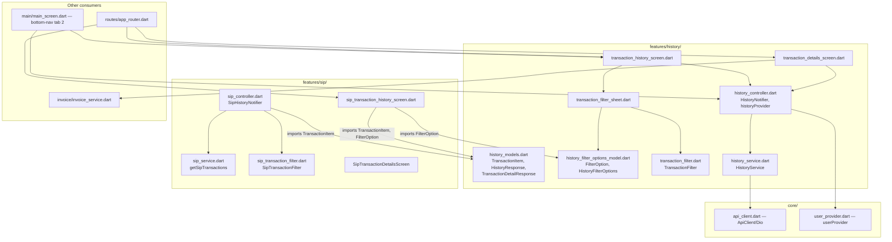

# History — Cross-Module Map

## The SIP transaction-history split

`STARTGOLD_DOCUMENTATION.md` covers "Transaction History & Details" as one undifferentiated
section (§3.27-3.28), but the codebase actually has **two parallel implementations**:

| Aspect | General History (`features/history/`) | SIP History (`features/sip/`) |
|---|---|---|
| Screen | `transaction_history_screen.dart` | `sip_transaction_history_screen.dart` |
| Route | `/transaction-history` (`AppRouter.transactionHistory`) | `/sip-transactions` (`AppRouter.sipTransactions`) |
| Controller | `HistoryNotifier` (`history_controller.dart`) | `SipHistoryNotifier` (`sip_controller.dart:253+`) |
| List endpoint | `POST transactions/history` | `POST sip/transactions` |
| Filter-options endpoint | `POST transactions/filter-options` | `POST sip/transaction-filter-options` |
| Detail screen | `TransactionDetailsScreen` | `SipTransactionDetailsScreen` (separate class) |
| Filter model | `TransactionFilter` (date/metal/type/status) | `SipTransactionFilter` (adds a frequency tab: daily/weekly/monthly) |
| List/response model | `TransactionItem` / `HistoryResponse` — **owned by `history`** | Same `TransactionItem` / `HistoryResponse` — **imported from `history`**, not redefined |
| Filter option model | `FilterOption` — **owned by `history`** | Same `FilterOption` — **imported from `history`** |

Confirmed via imports:
- `sip_transaction_history_screen.dart:15-16`:
  `import '../../history/models/history_models.dart';` and
  `import '../../history/models/history_filter_options_model.dart' show FilterOption;`
- `sip_controller.dart:7`: `import '../../history/models/history_models.dart' show TransactionItem;`
- `sip_service.dart:217-218` (doc comment): *"Reuses the same `HistoryResponse` model from the
  history module since the response structure (grouped_transactions + pagination) is identical."*

**Direction of the dependency**: `sip` → `history` (models only). `history` has zero imports
from `features/sip/` — confirmed via search, no reverse reference found. This is consistent with
AGENTS.md §1's "cross-feature reuse... never import one feature's internals directly from
another feature" — the exception here is explicit, narrow (data models only, not controllers or
services), and intentional (SIP's own code comment justifies it as "same principle as
HistoryService.getTransactionHistory").

**Why they're separate rather than one screen with a SIP filter**: SIP transactions are
frequency-tabbed (daily/weekly/monthly AutoPay cycles) — a dimension general history has no
concept of — and SIP has its own backend product/endpoint entirely (`sip/transactions` vs.
`transactions/history`), so a unified screen would need to branch on transaction origin for both
data-fetching and UI. The current split avoids that at the cost of duplicated
list/lazy-load/filter-sheet UI code (see `MODULE_BRAIN.md` §7, point 4).

## Dependency graph

## Known violations / notes

- None found beyond the intentional, documented model-reuse noted above. `history` does not
  reach into `sip`'s controller/service, and `sip` does not reach into `history`'s controller —
  only the plain-data model files are shared.
- `TransactionDetailsScreen` imports `features/invoice/invoice_service.dart` directly (not a
  route-level handoff) to download invoices before navigating to the invoice viewer route —
  worth noting for the `Invoice` module brain when it's built (`invoice_service.dart`,
  `transaction_details_screen.dart:11, 368-393`).
- `history` depends on `core/network/api_client.dart` (via `HistoryService`) and
  `core/providers/user_provider.dart` (via `historyProvider`'s `ref.read(userProvider)`) — both
  are the standard core dependencies, no anomalies.

## Cross-reference notes for other module brains

- **SIP module brain** (when built): should document `SipHistoryNotifier`/`sip_service.dart`'s
  `getSipTransactions`/`getSipTransactionFilterOptions` fully there, but link back here for the
  shared `TransactionItem`/`HistoryResponse`/`FilterOption` shapes rather than re-defining them.
- **`_SYSTEM/MODULE_DEPENDENCIES.md`** (when built): record `sip` → `history` (models-only edge)
  as an explicit, intentional exception to the standard feature-isolation rule.
