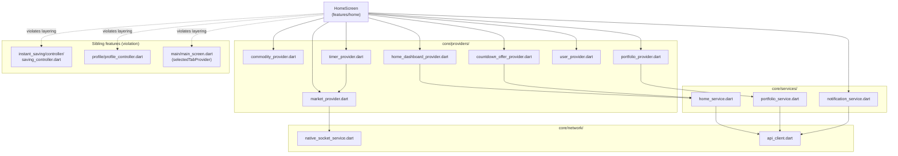

# Home — Cross-Module Map

Home is UI-only (no `controller/`/`services/`/`providers/` of its own) and is one of the heaviest consumers
of `lib/core/providers/` in the app. It also has three confirmed cross-**feature** import violations (see
`MODULE_BRAIN.md` §6).

## `core/` Dependencies

| Core file | What Home uses | Shared with |
|---|---|---|
| `core/providers/commodity_provider.dart` | `commodityProvider`, `selectedMetalIdProvider` | Every commodity-aware feature (InstantSaving, Withdrawal, Market, DailySavings — unconfirmed for all, high-confidence given the provider's global scope) |
| `core/providers/market_provider.dart` | `marketRatesStreamProvider`, `marketStatusProvider`, (indirectly `socketIOServiceProvider`) | InstantSaving, Withdrawal (per `AGENTS.md` — both screens documented as reading live rates + market status) |
| `core/providers/timer_provider.dart` | `sellRateTimerProvider` | `buyRateTimerProvider` is the withdrawal-side twin (not used by Home) — same `RateTimerNotifier` class, separate provider instance |
| `core/providers/home_dashboard_provider.dart` | `homeDashboardProvider` | Home-exclusive (module name matches; not referenced elsewhere at time of writing) |
| `core/providers/portfolio_provider.dart` | `portfolioProvider`, `PortfolioData`, `CommodityPortfolio` | Likely also read by Withdrawal (unconfirmed — not verified in this round) |
| `core/providers/countdown_offer_provider.dart` | `countdownOfferProvider` | Home-exclusive |
| `core/providers/user_provider.dart` | `userProvider`, `UserProfile` | App-wide (depends on `features/auth/controller/auth_controller.dart`) |
| `core/providers/environment_provider.dart` | transitively via `market_provider.dart:9` | App-wide |
| `core/services/home_service.dart` | `HomeService` (`getHomeDashboard`, `getCountdownOffer`) — lives in `core/`, not `features/home/`, despite the name | Home-exclusive |
| `core/services/portfolio_service.dart` | `PortfolioService.getPortfolioSummary` | Shared via `portfolioProvider` |
| `core/services/notification_service.dart` | `notificationProvider`, `unreadCountProvider`, `AppNotification` | Notifications module (full inbox), Home (badge only) |
| `core/network/native_socket_service.dart` | Indirectly via `market_provider.dart` (Socket.IO-style raw WebSocket, pipe-delimited frames) | InstantSaving, Withdrawal |
| `core/network/api_client.dart` | Indirectly via every `*_service.dart` above (Dio singleton, `AppConfig.baseUrl`) | App-wide |
| `core/localization/language_provider.dart` | `ref.tr(...)` for `welcome`, `goldLabel`, `silverLabel`, `portfolioError` | App-wide |

## Cross-Feature Imports (violates `AGENTS.md` §1 "never import one feature's internals directly from another feature")

| Import | File:line | Provider pulled in | Risk |
|---|---|---|---|
| `../instant_saving/controller/saving_controller.dart` | `home_screen.dart:28` | `savingConfigProvider` → `SavingConfig.sellRateLockSeconds` | A refactor of InstantSaving's controller (e.g. renaming/restructuring `SavingConfig`) breaks Home's rate-lock timer with no core-layer signal |
| `../profile/profile_controller.dart` | `home_screen.dart:19` | `profileProvider` → name/photo/referral message | Profile screen changes to `ProfileState` shape can silently break Home's greeting + referral banner |
| `../main/main_screen.dart` | `home_screen.dart:20` | `selectedTabProvider` | Couples Home to Main's tab-index scheme (index 0 = Home is an implicit contract) |

**Recommendation for future refactor** (not applied — flagging only, per this round's scope): move
`selectedTabProvider` and `savingConfigProvider`/`SavingConfig` to `core/providers/` since they are
consumed cross-feature already; `profileProvider`'s greeting-relevant fields (name, photo, referral_message)
could be surfaced via a lighter `core/providers/user_provider.dart` extension instead of importing the full
profile controller.

## Downstream Navigation Targets (Home → other features)

| Trigger | Route constant | Target feature |
|---|---|---|
| Notification bell tap | `AppRouter.notifications` | `notifications` |
| "Withdrawal" button / Discover tile | `AppRouter.withdrawal` | `withdrawal` |
| "Invest More" / "Invest Now" buttons | `selectedTabProvider.notifier.state = 1` (in-place tab switch, not a route) | `instant_saving` (tab 1, per `main_screen.dart` `IndexedStack` ordering — unconfirmed exact tab-to-feature mapping beyond index 0=Home) |
| Discover → "Refer & Earn Rewards" | `AppRouter.referral` | `referral` |
| Discover → "Auto Saving" / MicroSavingsBanner swipe | `AppRouter.autoSavings` | `sip` |
| Support → "Contact Us" | `AppRouter.contact` | `content` |
| Countdown offer CTAs ("Start Investing"/"Add Investment") | `AppRouter.instantSaving` | `instant_saving` |
| Countdown offer "Know more"/"About the Offer" | `MaterialPageRoute` → `OfferWebViewScreen` (not a named route) | in-module WebView, deep-links back to `/instantSaving` |

## Dependency Graph

