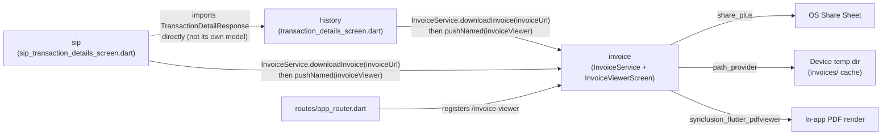

# Invoice — Cross-Module Map

## Dependency graph

## Inbound dependencies (who calls into `invoice`)

| Caller module | File | What it uses | Notes |
|---|---|---|---|
| `history` | `screens/transaction_details_screen.dart:11,368-395` | `InvoiceService.downloadInvoice()`, `AppRouter.invoiceViewer` | Imports `invoice_service.dart` directly (feature→feature import, not routed through `shared/`/`core/` — see "Known violations" below) |
| `sip` | `screens/sip_transaction_details_screen.dart:8,290-317` | `InvoiceService.downloadInvoice()`, `AppRouter.invoiceViewer` | Same direct-import pattern; near-duplicate code block of `history`'s call site |

No other module references `invoice_service.dart`, `InvoiceViewerScreen`, or
`AppRouter.invoiceViewer` (verified via repo-wide grep).

## Outbound dependencies (what `invoice` depends on)

| Dependency | Type | Where used |
|---|---|---|
| `core/security/secure_logger.dart` | `core/` | `invoice_service.dart:5` — debug/error logging only |
| `shared/theme/app_theme.dart` | `shared/` | `invoice_viewer_screen.dart:7` — `AppTheme.primaryGreen` for the loading spinner color |
| `dio` (package) | 3rd-party | Own `Dio()` instance, **not** `core/network/api_client.dart` — see MODULE_BRAIN.md §3/BUSINESS_RULES RULE-INVOICE-004 |
| `path_provider`, `path` | 3rd-party | Temp-dir cache path construction |
| `syncfusion_flutter_pdfviewer` | 3rd-party | `pubspec.yaml:48` — `SfPdfViewer.file()`, confirmed the only PDF-render surface in the app (no other module imports this package) |
| `share_plus` | 3rd-party | Share/export the cached PDF |

`invoice` does **not** depend on: `core/network/api_client.dart`, `core/security/encryption_service.dart`,
any Riverpod provider, `flutter_secure_storage`, or any other feature module's internals.

## Known violations of `AGENTS.md` §1 layering rules

1. **`history` and `sip` both import `invoice_service.dart` directly** — a feature-to-feature
   import. `AGENTS.md` §1 says cross-feature reuse should go through `lib/shared/` or `lib/core/`.
   `invoice` is neither — it's a sibling feature folder. In practice this is low-risk (it's a
   one-directional utility dependency, not a circular one), but it means `invoice` is really
   functioning as a shared utility that happens to live under `features/`. Worth considering a
   move to `core/services/` or `shared/` in a future refactor — flagged, not fixed here.
2. **`sip_transaction_details_screen.dart:15` imports `history/models/history_models.dart`**
   directly to reuse `TransactionDetailResponse` — a second, independent feature-to-feature
   import, and arguably a stronger violation since it's a *model* (data contract) owned by another
   feature's domain, not a stateless utility. If `history` changes `TransactionDetailResponse`'s
   shape for a `history`-specific reason, `sip`'s transaction-details screen silently inherits the
   change. Flagged as a candidate for `_SYSTEM/MODULE_DEPENDENCIES.md` and worth raising with the
   team — a shared model (e.g. in `core/models/` or `shared/models/`) would be more correct.

## Where invoice URLs originate (for context, not owned by this module)

| Origin module | Endpoint | Field | Model |
|---|---|---|---|
| `history` | `POST transactions/details` (`history_service.dart:77`) | `invoice_url` | `TransactionDetailResponse` (`history/models/history_models.dart:104`) |
| `sip` | `POST sip/transaction-details` (`sip_service.dart:279`) | `invoice_url` | Same `TransactionDetailResponse` class, reused (see violation #2 above) |

## Relationship to `home`/`portfolio` (not applicable)

`invoice` has no relationship to `home`, `portfolio_provider`, or any holdings/balance state — it
is purely a downstream PDF-viewer utility triggered from transaction-detail screens. No Mermaid
edge to `home` exists because none was found in code.
