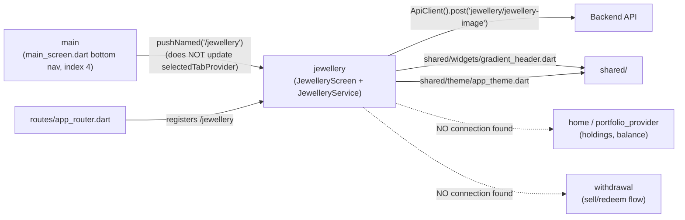

# Jewellery — Cross-Module Map

## Dependency graph

The two dashed edges are drawn deliberately to make the **absence** explicit — this is the answer
to "does jewellery connect to holdings/portfolio for redemption": **no, it does not**, confirmed by
repo-wide grep (MODULE_BRAIN.md §1, DATA_FLOW.md Flow 3).

## Inbound dependencies (who calls into `jewellery`)

| Caller module | File | What it uses | Notes |
|---|---|---|---|
| `main` | `main_screen.dart:76-77,223` | `Navigator.pushNamed('/jewellery')` | Only entry point in the entire app — no other module references `AppRouter.jewellery`, `JewelleryScreen`, or `JewelleryService` (repo-wide grep confirms `jewellery`/`Jewellery` appears only in `jewellery_screen.dart`, `jewellery_service.dart`, `app_router.dart`, and `main_screen.dart`) |

## Outbound dependencies (what `jewellery` depends on)

| Dependency | Type | Where used |
|---|---|---|
| `core/network/api_client.dart` | `core/` | `jewellery_service.dart:1,9` — uses the shared `ApiClient` singleton correctly (contrast with `invoice`, which uses a raw `Dio()` — see Invoice's `CROSS_MODULE_MAP.md`) |
| `core/security/secure_logger.dart` | `core/` | `jewellery_service.dart:2` — error logging only |
| `shared/widgets/gradient_header.dart` | `shared/` | `jewellery_screen.dart:5,73` — same header component used across the app |
| `shared/theme/app_theme.dart` | `shared/` | `jewellery_screen.dart:6` — gradients, `primaryGreen`, `buttonShadow` |
| `flutter_riverpod` | 3rd-party | `FutureProvider.autoDispose` |

`jewellery` does **not** depend on: `core/security/encryption_service.dart`,
`core/providers/portfolio_provider.dart`, `core/providers/timer_provider.dart` (no rate-lock —
nothing to price), `flutter_secure_storage`, any payment SDK (Cashfree/HyperSDK/Razorpay), or any
other feature module's internals.

## Relationship to Home / Portfolio (explicitly checked, not found)

Per the task's specific question — "does jewellery involve converting holdings, and should it link
to home/portfolio" — the answer based on live code is **no relationship exists**:
- `lib/features/home/` — zero references to `jewellery`/`Jewellery`/`redeem`/`Redeem` (grep).
- `lib/core/providers/portfolio_provider.dart` — not imported by `jewellery_screen.dart` or
  `jewellery_service.dart`.
- `lib/features/withdrawal/` — not referenced by, and does not reference, `jewellery`.

If a future redemption feature is built, it would need new wiring through `portfolio_provider.dart`
(to read gold/silver weight balances) and likely a new `withdrawal`-adjacent flow — none of that
exists today.

## Known violations of `AGENTS.md` §1 layering rules

None found. `jewellery` uses the shared `ApiClient` (not a raw `Dio()`) and shared
widgets/theme correctly — this module is actually a **cleaner** example of the intended layering
than `invoice` (see Invoice's `CROSS_MODULE_MAP.md` for the violations found there).
