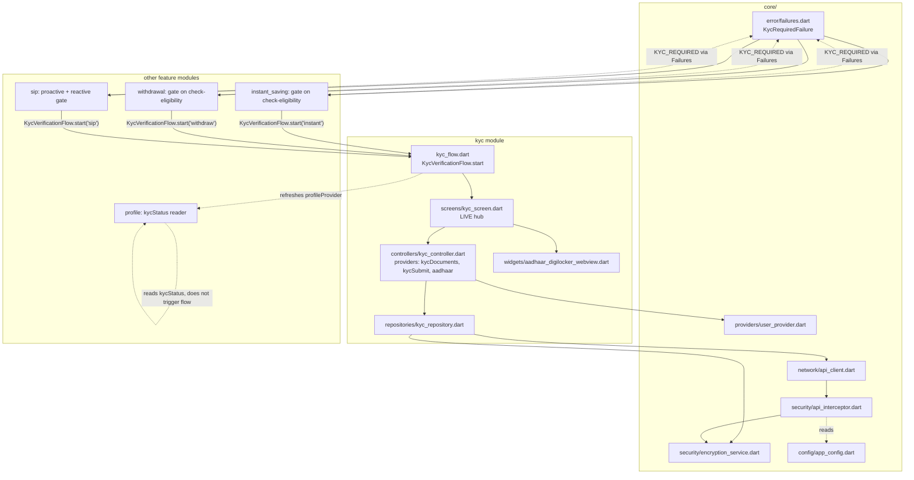

# KYC — Cross-Module Map

## Architectural variance: repository layer

`kyc` is one of the few modules in this codebase with a dedicated `repositories/` folder
(`KycRepository`) sitting between the controller/provider layer and `ApiClient`, rather than the
`services/` naming (`SavingService`, `WithdrawalService`, etc.) most other modules use — per
`.agents/config.md` module registry note ("has a repository layer, unlike most other features"). In
practice `KycRepository` plays exactly the Service role described in
`.agents/skills/flutter_fintech_mobile/SKILL.md` §1 (business logic, request/response shaping, encryption
field selection, the only class calling `ApiClient`) — it is a naming variance, not a different
architectural pattern. Layering is otherwise standard: `Screen → Controller/Provider (Riverpod) →
KycRepository → ApiClient`.

**Second variance (folder-content inversion, not just naming):** `controllers/kyc_controller.dart` holds
Riverpod *providers* (`kycDocumentsProvider`, `kycSubmitProvider`, `aadhaarProvider` + their notifiers), and
`providers/kyc_provider.dart` holds a legacy Riverpod *StateNotifier controller* (`KycNotifier`). Every other
module reviewed so far keeps `providers/` = providers, `controller(s)/` = notifiers/controllers — `kyc` is
inverted. Confirmed by direct read of both files (see `MODULE_BRAIN.md` §2).

## Dependencies on `core/`

| `core/` file | What KYC uses it for |
|---|---|
| `core/network/api_client.dart` (`ApiClient`) | Only caller: `KycRepository` — all 3 endpoints. |
| `core/security/encryption_service.dart` (`EncryptionService`) | `encryptJson()` on PAN/Aadhaar fields before posting (`kyc_repository.dart:51,160`). |
| `core/security/api_interceptor.dart` (`ApiSecurityInterceptor`) | Auto-encrypts `kyc/upload` payloads a second time (endpoint listed in `AppConfig.encryptedEndpoints`) — see `BUSINESS_RULES.md` RULE-KYC-011. |
| `core/security/secure_logger.dart` (`SecureLogger`) | Debug logging in `KycRepository` (PAN/Aadhaar values masked before logging) and `AadhaarNotifier` (technical errors logged, never shown to user). |
| `core/error/failures.dart` (`Failure`, `KycRequiredFailure`, `ApiFailureMapper`) | `KycRequiredFailure` is KYC's one contribution to the shared failure-type hierarchy — thrown when `error.code == 'KYC_REQUIRED'`; consumed by 3 other modules, not by `kyc` itself. |
| `core/providers/user_provider.dart` (`userProvider`) | `kycDocumentsProvider` reads the current user's `id` as `customerId`; returns an empty result if no user is logged in. |
| `core/config/app_config.dart` (`AppConfig`) | `sensitiveFields` (encryption key list), `encryptedEndpoints` (includes `kyc/upload`). |

## Dependencies on `shared/`

`shared/theme/app_theme.dart`, `shared/theme/app_text_styles.dart`, `shared/widgets/custom_button.dart`,
`shared/widgets/app_toast.dart`, `shared/widgets/gradient_header.dart`, `shared/widgets/animations.dart`,
`shared/widgets/secure_clipboard.dart` (blocks paste-context-menu on PAN/Aadhaar fields — OWASP clipboard
hygiene control from SKILL.md §2), `shared/utils/aadhaar_input_formatter.dart` (`AadhaarInputFormatter` —
formats/unformats the Aadhaar number input mask).

## Dependencies on other features (inbound — who KYC reads from)

- `features/profile/profile_controller.dart` (`pc.profileProvider`) — `kyc_flow.dart:3,40` imports this to
  refresh the profile after KYC completes, so `Profile`'s cached `user.kycStatus` stays fresh. This is the
  one place `kyc` reaches into another feature's controller directly — technically a "Feature A → Feature B
  internals" edge per SKILL.md §1's must-not list, though it's a narrow, deliberate exception (refresh-only,
  no state mutation) rather than layer-skipping.

## Dependents (outbound — who imports/uses `kyc`)

| Module | File | What it uses | `requestFrom` value |
|---|---|---|---|
| InstantSaving | `instant_saving/instant_saving_screen.dart:1591-1610` | `KycVerificationFlow.start()` on `EligibilityResponse.nextStep == 'KYC_REQUIRED'` | `'instant'` |
| Withdrawal | `withdrawal/screens/withdrawal_screen.dart:1119-1130` | `KycVerificationFlow.start()` on `nextStep == 'KYC_REQUIRED'` | `'withdraw'` |
| SIP | `sip/screens/auto_savings_screen.dart` (proactive: 1393-1400; backstop: 2081-2116, 2254-2301) | `KycVerificationFlow.start()` — both a proactive `user.kycStatus` check AND a reactive `KYC_REQUIRED`/`KycRequiredFailure` catch | `'sip'` |
| Profile | `profile_controller.dart` / `profile_screen.dart` | Reads `user.kycStatus` (int, 0/1) for the "Verified" pill (line 192-198) and the profile-completion percentage (line 612-616) — does NOT itself trigger `KycVerificationFlow`; it's a read-only consumer of the status KYC writes. | n/a |

**Every downstream module goes through the single `KycVerificationFlow.start()` entry point** — none of
InstantSaving/Withdrawal/SIP construct the `/kyc` route args or read `kycDocumentsProvider`/`aadhaarProvider`
directly. This is the correct, enforced integration boundary; do not add a second way to launch the KYC hub.

## Not part of this module (common misattribution)

- **Bank verification** (`AppRouter.bankVerificationHub`, `/bank-verification-hub`) lives entirely in
  `features/profile/screens/bank_verification_hub_screen.dart` — a different module. The legacy `kyc/kyc_screen.dart`
  (dead code) has a "Bank Details" step that routes to `AppRouter.bankVerification` (`/bank-verification`),
  which resolves to an inline placeholder `Scaffold(Text('Bank Verification'))` in `app_router.dart:161-162`
  — also dead/unfinished, and NOT the real bank-verification flow. When investigating a bank-linking issue,
  go to `profile`, not `kyc`.
- **PAN-only KYC used to be handled inline in InstantSaving** per a code comment in `kyc_flow.dart:12-14`
  ("mirroring the pattern instant_saving_screen.dart already used for PAN-only KYC") — `KycVerificationFlow`
  centralizes what was previously duplicated per-module logic. Worth checking `instant_saving`'s own brain
  for any remaining pre-centralization leftovers.

## Mermaid — Dependency Graph

