# CROSS_MODULE_MAP — MPIN

## Dependencies on `core/`

| `core/` file | What `mpin` uses from it |
|---|---|
| `core/services/mpin_service.dart` | `MpinService`, `mpinServiceProvider`, `MpinState`, `MpinNotifier`, `mpinProvider`, `MpinNotifier.pinLength` — the module's entire state/API layer |
| `core/services/biometric_service.dart` | `BiometricService.canUseBiometric()`, `.authenticate()` |
| `core/services/auth_service.dart` | `AuthService().sendOtp(...)` — only from `mpin_screen.dart:_handleForgotPin` |
| `core/services/notification_service.dart` | `NotificationService().registerFcmToken(token)` |
| `core/services/fcm_service.dart` | `FcmService.getToken()` |
| `core/security/secure_storage_service.dart` | `isMpinEnabled/setMpinEnabled`, `isBiometricEnabled` (indirectly via `BiometricService`), `getMobile`, `logout` |
| `core/security/screenshot_security_service.dart` | `secureScreen()`/`releaseScreen()` — `mpin_screen.dart` only, **not** `change_mpin_screen.dart` (see MODULE_BRAIN §7) |
| `core/security/session_manager.dart` | Not called directly by module files, but its `isForceLoggedOut` gate (consumed by `AppLifecycleObserver`) and `SessionManager.forceLogout()` (consumed by `api_interceptor.dart`) determine whether the MPIN screen ever gets pushed on resume |
| `core/security/api_interceptor.dart` | Not called directly — governs encryption (`AppConfig.encryptedEndpoints`) and 409→`SessionInvalidatedDialog` for every `mpin/*` request made via `ApiClient` |
| `core/security/encryption_service.dart` | Not called directly — invoked by the interceptor for `mpin`/`old_mpin`/`new_mpin`/`mobile` fields |
| `core/config/app_config.dart` | `sensitiveFields`, `encryptedEndpoints` (indirectly, via the interceptor) |
| `core/constants/app_constants.dart` | `mpinTitle`, `mpinSubtitle`, `mpinWithdrawalTitle/Subtitle`, `mpinBiometricTitle/Subtitle` |
| `core/network/api_client.dart` | Underlying Dio wrapper used by `MpinService` |
| `core/error/failures.dart` | `ApiFailureMapper.map(e)`, `SessionInvalidatedFailure` — consumed in `MpinNotifier.verifyMpin`'s catch clauses |

## Reverse dependency: `core/security/app_lifecycle_observer.dart` → `mpin`

`AppLifecycleObserver` (owned by `core/security/`, not by this module) is the **primary trigger** for the `app_lock` mode — it pushes `AppRouter.mpin` with `type: 'app_lock'` on qualifying resume events (`app_lifecycle_observer.dart:203-204`). This is a `core/` → `features/mpin` dependency, the inverse of the usual layering — noted here per AGENTS.md §1 ("record any exception found in CROSS_MODULE_MAP.md"). It is not a true layering violation since `core/` is allowed to reference route constants (`AppRouter.mpin`) and screens by route name without importing feature-internal classes directly — but it does mean this module's `app_lock` argument contract is depended upon by `core/`.

## Who navigates INTO `mpin` (by module)

| Caller module/file | Target | `type` used |
|---|---|---|
| `auth/otp/otp_screen.dart:434,446,475,485` | `/mpin` | untyped (login default), `reset_pin`, untyped, `setup` |
| `auth/registration/registration_screen.dart:547` | `/mpin-creation` (**not** this module — routes to `auth`'s own `PinCreationScreen`) | n/a |
| `profile/profile_screen.dart:84,323` | `/mpin`, `/change-mpin` | `verify_only`; n/a |
| `withdrawal/screens/withdrawal_confirmation_screen.dart:466` | `/mpin` | `withdrawal_pin` |
| `settings/settings_screen.dart:49` | `/mpin` | untyped — see MODULE_BRAIN §7 anti-pattern #1 |
| `splash/splash_screen.dart:71` | `/mpin` | untyped |
| `core/security/app_lifecycle_observer.dart:203` | `/mpin` | `app_lock` |
| `routes/app_router.dart:404` (unknown-route fallback) | `/mpin` | untyped |
| `core/utils/navigation_utils.dart:40` | `/mpin` | untyped |
| `mpin_screen.dart` itself (self-navigation) | `/mpin` | `verify_after_reset` (`:692-700`), untyped (`:703-707`, post-reset-not-from-app-lock) |

## Where `mpin` navigates OUT to

| Destination | From | Condition |
|---|---|---|
| `AppRouter.main` | `mpin_screen.dart:731,737` | Successful `verify_after_reset` or default-verify |
| `AppRouter.login` | `mpin_screen.dart:213` | `SESSION_EXPIRED` error listener |
| `AppRouter.otp` | `mpin_screen.dart:811,825` (`_handleForgotPin`) | User taps "Forgot PIN?" |
| `Navigator.pop(context, true/pin/null)` | Multiple `_handleAction`/`_authenticateBiometric` branches | `withdrawal_pin` (returns PIN string), `verify_only`, `app_lock` (returns `true`) — caller (Profile/Withdrawal/AppLifecycleObserver-pushed route) resumes |
| Self (`AppRouter.mpin`, different `type`) | `mpin_screen.dart:692-707` | `reset_pin` success → `verify_after_reset` or untyped |
| `main` via `_showSuccessDialog` | `mpin_screen.dart:848-896` | `authorize_withdrawal` (unreachable call site — see MODULE_BRAIN §7 anti-pattern #2) |

`change_mpin_screen.dart` never navigates elsewhere — it only pops itself (twice: dialog pop, then screen pop) on success (`:172-175`), or shows an error toast and resets to step 1 on failure. It has no error-driven redirect (no `SESSION_EXPIRED` handling of its own — a 409/session-expiry during `changeMpin()` surfaces only as a generic exception message via `AppToast`, unlike `mpin_screen.dart`'s dedicated `SESSION_EXPIRED` listener).

## Dependency Graph

```mermaid
graph TD
    subgraph Callers
        AuthOtp["auth/otp/otp_screen.dart"]
        Profile["profile/profile_screen.dart"]
        Withdrawal["withdrawal/withdrawal_confirmation_screen.dart"]
        Settings["settings/settings_screen.dart"]
        Splash["splash/splash_screen.dart"]
        Router["routes/app_router.dart (fallback)"]
        NavUtils["core/utils/navigation_utils.dart"]
    end

    LifecycleObs["core/security/app_lifecycle_observer.dart"]

    subgraph MPIN["features/mpin"]
        MpinScreen["mpin_screen.dart"]
        ChangeMpinScreen["change_mpin_screen.dart"]
    end

    subgraph CoreServices["core/services + core/security"]
        MpinService["core/services/mpin_service.dart\n(MpinService, MpinNotifier)"]
        BiometricSvc["core/services/biometric_service.dart"]
        AuthSvc["core/services/auth_service.dart"]
        NotifSvc["core/services/notification_service.dart"]
        FcmSvc["core/services/fcm_service.dart"]
        SecureStorage["core/security/secure_storage_service.dart"]
        Screenshot["core/security/screenshot_security_service.dart"]
        SessionMgr["core/security/session_manager.dart"]
        Interceptor["core/security/api_interceptor.dart"]
        Encryption["core/security/encryption_service.dart"]
        AppConfig["core/config/app_config.dart"]
    end

    AuthOtp -->|"push /mpin (login/setup/reset_pin)"| MpinScreen
    Profile -->|"push /mpin (verify_only)"| MpinScreen
    Profile -->|"push /change-mpin"| ChangeMpinScreen
    Withdrawal -->|"push /mpin (withdrawal_pin)"| MpinScreen
    Settings -->|"push /mpin (untyped)"| MpinScreen
    Splash -->|"push /mpin (untyped)"| MpinScreen
    Router -->|"fallback push /mpin"| MpinScreen
    NavUtils -->|"fallback push /mpin"| MpinScreen
    LifecycleObs -->|"push /mpin (app_lock)"| MpinScreen

    MpinScreen --> MpinService
    ChangeMpinScreen --> MpinService
    MpinScreen --> BiometricSvc
    MpinScreen --> AuthSvc
    MpinScreen --> NotifSvc
    MpinScreen --> FcmSvc
    MpinScreen --> SecureStorage
    MpinScreen --> Screenshot

    LifecycleObs --> BiometricSvc
    LifecycleObs --> SessionMgr
    LifecycleObs --> SecureStorage

    MpinService --> Interceptor
    Interceptor --> Encryption
    Interceptor --> AppConfig
    Interceptor --> SessionMgr

    MpinScreen -.->|"pop(true/pin) back to caller"| Profile
    MpinScreen -.->|"pop(true/pin) back to caller"| Withdrawal
    MpinScreen -.->|"pop(true) back to caller"| LifecycleObs
    MpinScreen -.->|"pushNamedAndRemoveUntil"| MainRoute["AppRouter.main"]
    MpinScreen -.->|"SESSION_EXPIRED redirect"| LoginRoute["AppRouter.login"]
    MpinScreen -.->|"Forgot PIN"| OtpRoute["AppRouter.otp"]
```

## Known Layering Notes (not violations, but worth recording)

- `core/security/app_lifecycle_observer.dart` (a `core/` file) directly references `AppRouter.mpin` and pushes it with a feature-specific argument contract (`{'type': 'app_lock'}`) — this is a reverse dependency (`core` → `features/mpin`'s argument shape) rather than a strict layering violation, since it goes through the named-route system rather than importing `MpinScreen` directly.
- `change_mpin_screen.dart` bypasses `MpinNotifier`/`mpinProvider` entirely and talks to `MpinService.changeMpin()` directly from `ConsumerState` — consistent with AGENTS.md §1 (`Screen → Service` is allowed; the notifier is optional plumbing for shared state, and Change-MPIN's PIN entry state is genuinely screen-local, not shared).
