# Main — Cross-Module Map

`main` has, by far, the widest outbound fan-out of the four low-complexity modules — it is a
composition root that hosts other features' top-level screens and reaches into their providers
directly. Per `AGENTS.md` §1 ("cross-feature reuse goes through `lib/shared/` or `lib/core/` —
never import one feature's internals directly from another feature"), this module is a
**documented, structural exception**: it imports screen widgets and provider symbols directly from
`home`, `instant_saving`, `history`, `profile`, and `auth` — which is expected for a tab-shell
container (it has to render those screens somewhere), but is worth recording explicitly as an
architecture exception rather than silently normalizing it.

## Outbound dependencies

### Hosted screens (rendered inside `IndexedStack`)

| Tab | Screen | Owning module | Import |
|---|---|---|---|
| 0 Home | `HomeScreen` | `home` | `../home/home_screen.dart` |
| 1 Invest | `InstantSavingScreen` | `instant_saving` | `../instant_saving/instant_saving_screen.dart` |
| 2 History | `TransactionHistoryScreen` | `history` | `../history/screens/transaction_history_screen.dart` |
| 3 Profile | `ProfileScreen` | `profile` | `../profile/profile_screen.dart` |
| 4 Jewellery (pushed route, not hosted) | `JewelleryScreen` | `jewellery` | reached via `Navigator.pushNamed('/jewellery')`, not a direct import |

### Providers/controllers read or invalidated

| Provider | Owning module/layer | File |
|---|---|---|
| `homeDashboardProvider` | `core` | `core/providers/home_dashboard_provider.dart:9` |
| `portfolioProvider` | `core` | `core/providers/portfolio_provider.dart:99` |
| `profileProvider` | `profile` | `features/profile/profile_controller.dart:331` |
| `savingConfigProvider` | `instant_saving` | `features/instant_saving/controller/saving_controller.dart:8` |
| `historyProvider` | `history` | `features/history/controller/history_controller.dart:172` |
| `authControllerProvider` | `auth` | `features/auth/controller/auth_controller.dart:45` |
| `notificationProvider` | `core` | `core/services/notification_service.dart:257` |

### Shared widgets/theme

| Dependency | File |
|---|---|
| `AppTheme` | `shared/theme/app_theme.dart` |
| `AppToast` | `shared/widgets/app_toast.dart` |

## Inbound dependencies (what navigates *to* `/main` or `/home`)

Not exhaustively enumerated in this round (would require tracing every screen in the app) —
notable known entry points: MPIN verify success, splash's `/mpin` chain terminating here, and any
screen passing `arguments: {resetTab: true}` after a payment-success flow (per the `initState`
comment, `main_screen.dart:39-40`). A full inbound census is deferred to whichever module brain
build covers `mpin`/`auth`/`instant_saving` payment completion — flagged here rather than guessed.

## Mermaid

```mermaid
graph TD
    Main["features/main<br/>MainScreen<br/>(selectedTabProvider)"]

    Main -- "tab 0, always mounted" --> Home["features/home<br/>HomeScreen"]
    Main -- "tab 1, lazy" --> Invest["features/instant_saving<br/>InstantSavingScreen"]
    Main -- "tab 2, lazy" --> History["features/history<br/>TransactionHistoryScreen"]
    Main -- "tab 3, lazy" --> Profile["features/profile<br/>ProfileScreen"]
    Main -- "pushNamed (not IndexedStack)" --> Jewellery["features/jewellery<br/>JewelleryScreen"]

    Main --> HomeDash["core/providers/<br/>home_dashboard_provider.dart"]
    Main --> Portfolio["core/providers/<br/>portfolio_provider.dart"]
    Main --> ProfileProv["features/profile/<br/>profile_controller.dart<br/>(profileProvider)"]
    Main --> SavingConfig["features/instant_saving/<br/>controller/saving_controller.dart<br/>(savingConfigProvider)"]
    Main --> HistoryProv["features/history/<br/>controller/history_controller.dart<br/>(historyProvider)"]
    Main --> AuthCtrl["features/auth/<br/>controller/auth_controller.dart<br/>(authControllerProvider)"]
    Main --> Notif["core/services/<br/>notification_service.dart<br/>(notificationProvider)"]
    Main --> Toast["shared/widgets/<br/>app_toast.dart"]

    style Jewellery stroke-dasharray: 5 5
```

## Known architecture exception (flag for `_SYSTEM/MODULE_DEPENDENCIES.md`)

`main` directly imports screens and providers from `home`, `instant_saving`, `history`, `profile`,
and `auth` — a feature-to-feature import pattern `AGENTS.md` §1 otherwise forbids. This is the
expected shape for a tab-shell container and should be treated as a sanctioned exception (record
it in `_SYSTEM/MODULE_DEPENDENCIES.md` when that system-level doc is built), not copied as a
precedent for feature-to-feature imports elsewhere.
