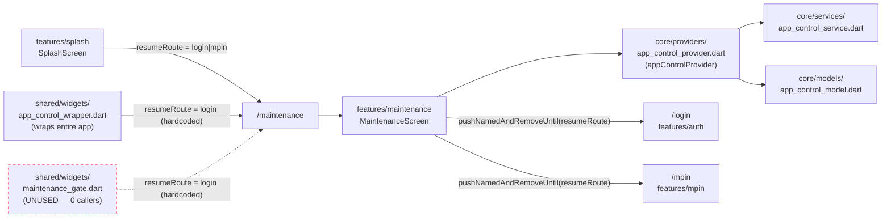

# Maintenance — Cross-Module Map

## Outbound dependencies (what `maintenance` reads from)

| Dependency | File | Used for |
|---|---|---|
| `appControlProvider` / `AppControlNotifier` / `AppControlState` | `core/providers/app_control_provider.dart` | polling control (`startMaintenancePolling`), reactive `isMaintenance` state |
| `MaintenanceInfo` | `core/models/app_control_model.dart` | displayed title/subtitle/expected-resume text |
| `AppTextStyles` | `shared/theme/app_text_styles.dart` | `labelMedium` for the auto-checking row |

## Inbound dependencies (what navigates *to* `/maintenance`)

| Caller | File | `resumeRoute` supplied |
|---|---|---|
| `SplashScreen._initializeApp()` | `features/splash/splash_screen.dart:85-88` | precomputed login/mpin decision |
| `AppControlWrapper` (mid-session global redirect, wraps entire `MaterialApp`) | `shared/widgets/app_control_wrapper.dart:51-63` | hardcoded `AppRouter.login` |
| `MaintenanceGate.check` (pre-transaction gate — **defined but currently unused**, zero call sites anywhere in `lib/` besides its own file) | `shared/widgets/maintenance_gate.dart:29-45` | hardcoded `AppRouter.login` |

`app_control_provider.dart` and its two consumer widgets (`app_control_wrapper.dart`,
`maintenance_gate.dart`) are architecturally part of `core`/`shared`, not the `maintenance`
feature module itself — but they're the module's only real "callers," so listed here in full for
completeness per `AGENTS.md` §6 (cross-module impact analysis before touching shared state).

## Mermaid

## Known deviation worth flagging in `_SYSTEM`

`resumeRoute` handling is inconsistent across the three inbound callers (see
`BUSINESS_RULES.md` RULE-MAINTENANCE-005) and `MaintenanceGate.check` is fully built but entirely
unused — both are candidates for `_SYSTEM/DANGER_ZONES.md` and/or
`_SYSTEM/DIAGNOSTIC_PLAYBOOK.md` once those system-level docs are built.
