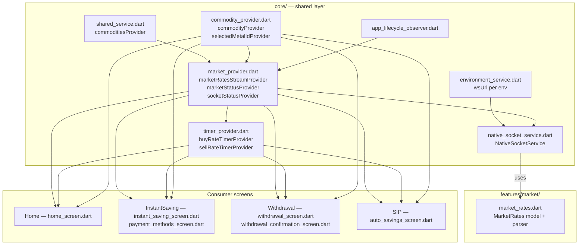

# Market — Cross-Module Map

## Who consumes what (verified via grep across `lib/`)

| Provider | Consumers (file) |
|---|---|
| `marketRatesStreamProvider` | `features/home/home_screen.dart`, `features/instant_saving/instant_saving_screen.dart`, `features/instant_saving/screens/payment_methods_screen.dart`, `features/withdrawal/screens/withdrawal_screen.dart`, `features/withdrawal/screens/withdrawal_confirmation_screen.dart`, `features/sip/screens/auto_savings_screen.dart`, `core/providers/timer_provider.dart` |
| `marketStatusProvider` | same set as above, minus `payment_methods_screen.dart` which only reads `marketRatesStreamProvider` for a sell-rate gram conversion |
| `socketIOServiceProvider` | `core/providers/market_provider.dart` (internal), `core/security/app_lifecycle_observer.dart` (connect/disconnect on lifecycle) |
| `commodityProvider` | `features/home/home_screen.dart` (tab switch UI) |
| `selectedMetalIdProvider` | `features/instant_saving/instant_saving_screen.dart` (submit purchase), `features/withdrawal/screens/withdrawal_screen.dart` (submit withdrawal), `features/withdrawal/screens/withdrawal_confirmation_screen.dart` |
| `buyRateTimerProvider` | InstantSaving, SIP entry screens |
| `sellRateTimerProvider` | Home (sell display), Withdrawal, Withdrawal confirmation |

## Dependency graph

## Known violations of the "features import core, not each other" rule

None found — `market` itself has essentially no feature-level code to violate the rule with. The
one thing worth flagging: **the actual market logic living in `core/` rather than
`features/market/`** is not a violation of AGENTS.md's layering rule (core is explicitly the
right home for cross-feature shared state per AGENTS.md §1), but it does mean anyone searching
`features/market/` for "how do live rates work" will find almost nothing — this brain exists
specifically to close that gap.

## Cross-reference notes for other module brains

- **Home** (`knowledge_brain/Home/` — not yet built as of this writing): should link back to
  this brain rather than re-documenting the socket protocol. Home is the primary consumer —
  it's the only screen that both switches `commodityProvider` and displays both buy/sell rate
  chips with market-status badges simultaneously.
- **InstantSaving / Withdrawal / SIP**: each independently re-implements the same
  "watch `marketStatusProvider` → compute `isCurrentMarketClosed` → watch
  `marketRatesStreamProvider` → restart the relevant rate timer on the first non-zero tick"
  pattern. This is duplicated logic (4 near-identical implementations), not shared through a
  common hook/widget — worth flagging as a refactor opportunity in
  `_SYSTEM/DANGER_ZONES.md` or a future cleanup pass, not a correctness bug.
- **`_SYSTEM/MODULE_DEPENDENCIES.md`** (when built): record `market`'s `core/` dependencies
  above as edges from `Home`, `InstantSaving`, `Withdrawal`, `SIP` → `core/network`,
  `core/providers` (market_provider, commodity_provider, timer_provider),
  `core/services` (environment_service, shared_service), `core/security`
  (app_lifecycle_observer).
