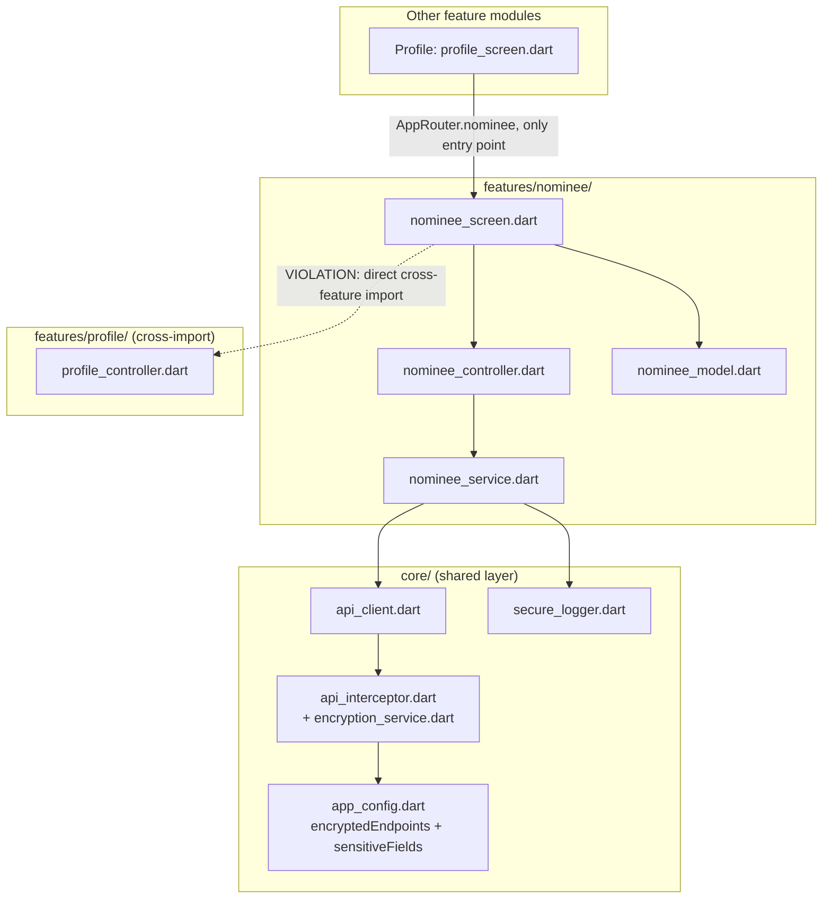

# Cross-Module Map — Nominee

---

## Dependencies (what Nominee reads/imports)

| Dependency | File | Why |
|---|---|---|
| `core/network/api_client.dart` | `nominee_service.dart:1,10` | All HTTP calls |
| `core/security/secure_logger.dart` | `nominee_service.dart:2`, `nominee_screen.dart:15` | Debug/error logging (`SecureLogger.d`/`.e`) |
| `core/security/api_interceptor.dart` (indirect, via `ApiClient`) | not directly imported | Applies field-level encryption to `mobile` because `users/nominee/update` is in `AppConfig.encryptedEndpoints` |
| `core/config/app_config.dart` (indirect, via interceptor) | not directly imported | `encryptedEndpoints` and `sensitiveFields` lists determine what gets encrypted |
| **`features/profile/profile_controller.dart`** | `nominee_screen.dart:16` (`import '../../profile/profile_controller.dart' as pc;`) | `pc.profileProvider.notifier.checkPincode(pincode)` — pincode-to-state/city/location-ID lookup, reused rather than duplicated |
| `shared/widgets/gradient_header.dart`, `custom_button.dart`, `app_toast.dart`, `secure_clipboard.dart`, `numeric_styled_text.dart` | screen UI | Shared widgets |
| `shared/utils/upper_case_words_formatter.dart` | `nominee_screen.dart:13` | Name/address input formatting |
| `shared/theme/app_theme.dart` | `nominee_screen.dart:14` | Colors/gradients |
| `routes/app_router.dart` | `AppRouter.nominee` constant | Route registration |

## Reverse Dependencies (what depends on Nominee)

| Consumer | File | Dependency |
|---|---|---|
| `Profile` | `lib/features/profile/profile_screen.dart:228-233` | "Nominee Details" menu item → `Navigator.pushNamed(context, AppRouter.nominee)` — this is the ONLY entry point found into this module |

No other module reads `nomineeDetailsProvider`, `hasNomineeProvider`, or any Nominee model/service —
`hasNomineeProvider` in particular looks like it was built for exactly this kind of external
"has the user added a nominee yet" check (e.g. a Profile completeness indicator or a KYC-adjacent
nudge), but no such consumer exists in the code as read. `unconfirmed`/flag as a possible planned-but-
unwired feature.

## Known Violations

**Direct feature-to-feature import**: `lib/features/nominee/screens/nominee_screen.dart` imports
`../../profile/profile_controller.dart` and calls `pc.profileProvider.notifier.checkPincode(pincode)`
directly (`nominee_screen.dart:16,1216`). Per `AGENTS.md` §1: "Cross-feature reuse goes through
`lib/shared/` or `lib/core/` — never import one feature's internals directly from another feature."
This is a genuine violation, not covered by any documented exception elsewhere in the repo at time of
this brain build. Two remediation options for a future refactor (not applied here — brain-build is
read-only): (a) move `checkPincode` into a `core/services/pincode_service.dart` shared by both
`Profile` and `Nominee`; (b) leave as-is if `Profile` is considered a "trusted utility" module by
convention — but that convention isn't stated anywhere in `AGENTS.md`, so option (a) is the safer
default recommendation.

## Mermaid Dependency Graph

