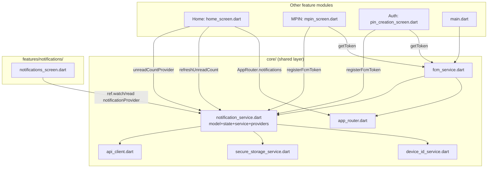

# Cross-Module Map — Notifications

---

## Dependencies (what Notifications reads/imports)

| Dependency | File | Why |
|---|---|---|
| `core/services/notification_service.dart` | itself owns model/state/service/providers | The feature-level screen is a pure consumer of core-owned state — unusual for this codebase's stated "feature owns its own model/service" convention (see Architectural Note below) |
| `core/services/fcm_service.dart` | push transport | Foreground display, tap navigation, token refresh |
| `core/security/secure_storage_service.dart` | `getFcmToken` / `saveFcmToken` (`AppConfig.keyFcmToken`) | Dedup so `register-token` isn't called on every app start |
| `core/services/device_id_service.dart` | `getDeviceId`, `getDeviceType`, `getDeviceInfo` | Populates the `register-token` payload |
| `core/network/api_client.dart` | `NotificationService._api` | All HTTP calls |
| `routes/app_router.dart` | `AppRouter.notifications` constant, `navigatorKey` | FCM navigation target |
| `shared/widgets/gradient_header.dart`, `app_toast.dart`, `numeric_styled_text.dart` | screen UI | Shared widgets |

## Reverse Dependencies (what depends on Notifications)

| Consumer | File | Dependency |
|---|---|---|
| `Home` | `lib/features/home/home_screen.dart:1116` | `ref.watch(unreadCountProvider)` for the bell badge |
| `Home` | `lib/features/home/home_screen.dart:45,145,184` | Calls `notificationProvider.notifier.refreshUnreadCount()` on init, pull-to-refresh, post-purchase/withdrawal |
| `Home` | `lib/features/home/home_screen.dart:1902` | Bell icon tap → `Navigator.pushNamed(context, AppRouter.notifications)` |
| `MPIN` | `lib/features/mpin/mpin_screen.dart:749-758` | Calls `FcmService.getToken()` + `NotificationService().registerFcmToken()` after successful login |
| `Auth` (PIN creation) | `lib/features/auth/pin/pin_creation_screen.dart:467-473` | Same registration call after PIN creation |
| `main.dart` | `main.dart:65` | Calls `FcmService.init()` at app startup, after `Firebase.initializeApp()` |

## Architectural Note (flag, not a bug)

Per `AGENTS.md` §1, feature modules should "own their own `screens/`, `controller/`, `models/`,
`services/`" and cross-feature reuse should go through `core/` or `shared/`. This module inverts that:
the ENTIRE model/state/service layer for notifications lives in `core/services/notification_service.dart`
rather than under `lib/features/notifications/`. This is a deliberate exception (not a violation of the
"never import one feature's internals from another" rule, since nothing else imports this module's
internals — there ARE no feature-internal files besides the screen) made so `Home` can depend on the
badge count via the neutral `core/` layer instead of reaching into `features/notifications/`. Record
this as the accepted pattern for any module whose state needs to be visible from `Home`'s header.

## Mermaid Dependency Graph

## Known Violations

None found — the single architectural deviation (state living in `core/` instead of the feature
folder) is documented above as an accepted pattern, not a violation, since no other feature reaches
into `features/notifications/` internals directly.
