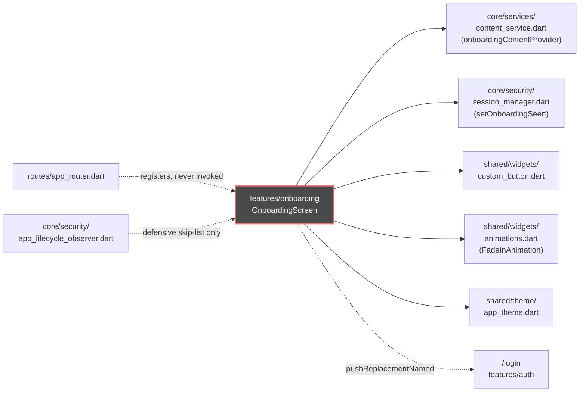

# Onboarding — Cross-Module Map

## Outbound dependencies (what `onboarding` reads from)

| Dependency | File | Used for |
|---|---|---|
| `onboardingContentProvider` / `ContentService` | `core/services/content_service.dart` | fetching carousel slides from `POST users/content/onboarding` |
| `SessionManager` | `core/security/session_manager.dart` | `setOnboardingSeen()` |
| `AppRouter` | `routes/app_router.dart` | route constant (`login`) |
| `CustomButton` | `shared/widgets/custom_button.dart` | the CTA button |
| `FadeInAnimation` | `shared/widgets/animations.dart` | staggered slide-content fade-in |
| `AppTheme` | `shared/theme/app_theme.dart` | colors/gradients (`arcticBlue`, `electricCyan`, `midnightNavy`, `primaryGreen`, `greenGradient`) |

## Inbound dependencies (what depends on `onboarding`)

**None found.** `routes/app_router.dart` registers the route but nothing navigates to it —
see `MODULE_BRAIN.md` §0 for the full grep-verified claim. The only other reference to
`AppRouter.onboarding` in the codebase is a defensive entry in
`core/security/app_lifecycle_observer.dart:150` (a route-skip list for the app-lock observer,
not a navigation trigger).

## Mermaid

*(Node styled to visually flag "reachable by nothing" in the graph — this module is orphaned.)*
