# Profile — Cross-Module Map

## Dependency Graph

```mermaid
graph TD
    subgraph Profile["features/profile/"]
        ProfileScreen
        AccountDetailsScreen
        BankDetailsScreen
        BankVerificationHub[BankVerificationHubScreen]
        BavHistory[BavHistoryScreen]
        PennyHistory[PennyVerifyHistoryScreen]
        RefundHistory[RefundHistoryScreen]
        BankPennyVerify[BankPennyVerifyScreen]
        DeleteAccount[DeleteAccountScreen]
        ProfileNotifier
        ProfileService
        BankDetailsService
        BankPennyVerifyService
        BankVerificationHistoryService
        DeleteAccountService
    end

    subgraph Shared["lib/shared/"]
        AddBankSheet[add_bank_account_sheet.dart]
        GradientHeader
        AppToast
    end

    subgraph Core["lib/core/"]
        ApiClient
        UserProviderCore[core/providers/user_provider.dart]
        AuthController[features/auth/controller/auth_controller.dart]
        BiometricService
        SecureStorageService
        AppLifecycleObserver
        EncryptionService
        AppConfig
    end

    subgraph OtherFeatures["Other Features"]
        Withdrawal[withdrawal/services/withdrawal_service.dart]
        SIPPicker[sip/screens/bank_account_picker_screen.dart]
        KYCFlow[kyc/kyc_flow.dart]
        InstantSavingSheet[instant_saving/widgets/payment_method_sheet.dart]
        EmailOtpSheet[auth/registration/email_otp_sheet.dart]
        MainScreen[main/main_screen.dart]
        Cashfree[Cashfree SDK]
        Razorpay[Razorpay SDK]
    end

    ProfileScreen --> ProfileNotifier
    AccountDetailsScreen --> ProfileNotifier
    ProfileNotifier --> ProfileService --> ApiClient
    BankDetailsScreen --> BankDetailsService --> ApiClient
    BankVerificationHub --> BankVerificationHistoryService --> ApiClient
    BavHistory --> BankVerificationHistoryService
    PennyHistory --> BankVerificationHistoryService
    RefundHistory --> BankVerificationHistoryService
    BankPennyVerify --> BankPennyVerifyService --> ApiClient
    DeleteAccount --> DeleteAccountService --> ApiClient

    BankDetailsScreen --> AddBankSheet
    AddBankSheet -->|verifyAndAddBank POST account\verify-bank BUGGY PATH| Withdrawal
    AddBankSheet --> BankDetailsService
    AddBankSheet -->|pushes on success| BankPennyVerify
    BankPennyVerify --> InstantSavingSheet
    BankPennyVerify --> Cashfree
    BankPennyVerify --> Razorpay
    BankPennyVerify --> AppLifecycleObserver

    SIPPicker -->|direct import: internals violation| BankDetailsService
    SIPPicker -->|direct import: internals violation| AddBankSheet
    KYCFlow -->|calls fetchProfileDetails after KYC done: internals violation| ProfileNotifier

    ProfileNotifier --> UserProviderCore
    UserProviderCore --> AuthController
    ProfileScreen --> BiometricService
    ProfileScreen --> SecureStorageService
    ProfileScreen --> MainScreen
    AccountDetailsScreen --> EmailOtpSheet
    AccountDetailsScreen --> AuthController
    DeleteAccount --> SecureStorageService

    ApiClient --> EncryptionService
    ApiClient --> AppConfig
```

## Dependencies On `core/`

| Core piece | Used by | Purpose |
|---|---|---|
| `core/network/api_client.dart` (`ApiClient`, Dio singleton) | Every service in this module | Sole HTTP transport — no raw `Dio()` instantiation found |
| `core/providers/user_provider.dart` (`userProvider`) | `ProfileNotifier` (scoped `.select((u) => u?.id)`), `BankPennyVerifyScreen` (prefill for Razorpay) | Customer id + mobile/email for prefill |
| `features/auth/controller/auth_controller.dart` (`authControllerProvider`) | `AccountDetailsScreen` (e-mail OTP send + error listener), `ProfileScreen._handleLogout` | Session/auth actions — logout, send-email-otp |
| `core/services/biometric_service.dart` | `ProfileScreen` (biometric toggle guard chain) | Device biometric capability + enrollment check |
| `core/security/secure_storage_service.dart` | `ProfileScreen` (biometric/MPIN flags), `DeleteAccountScreen._clearAllData` | Persisted security flags; full secure wipe on delete |
| `core/security/app_lifecycle_observer.dart` | `BankPennyVerifyScreen` | Suppress app-lock overlay during payment SDK handoff |
| `core/security/secure_logger.dart` | `BankPennyVerifyService`, `BankPennyVerifyScreen` | Structured debug/error logging (Razorpay failure detail) |
| `core/security/encryption_service.dart` + `core/config/app_config.dart` (`sensitiveFields`, `encryptedEndpoints`) | Indirectly, via `ApiClient`'s interceptor | Governs which of this module's payloads get RSA-encrypted — **none of Profile's own endpoints are in `encryptedEndpoints`**, see MODULE_BRAIN.md §5 |
| `core/utils/masking_utils.dart` (`MaskingUtils.maskMobile`) | `ProfileScreen`, `AccountDetailsScreen` | Masks phone number for display |
| `core/error/failures.dart` (`Failure`) | `BankDetailsScreen`, `add_bank_account_sheet.dart` | Typed error → user message mapping |
| `core/providers/app_control_provider.dart` | Indirectly — sets `AppConfig.enableScreenshotProtection` | Remote toggle affecting whether this module's screens get screenshot-blurred |

## Dependencies On Other Features

| Feature | What Profile depends on | Direction | Notes |
|---|---|---|---|
| `withdrawal` | `WithdrawalService.verifyAndAddBank()` | Profile → Withdrawal | Via `shared/widgets/add_bank_account_sheet.dart`, not a direct import from `features/profile/` itself — architecturally acceptable (goes through `shared/`), but the callee has the RULE-PROFILE-010 path bug |
| `instant_saving` | `PaymentMethodSheet` widget | Profile → InstantSaving | `BankPennyVerifyScreen` reuses the payment-method picker bottom sheet built for InstantSaving purchases |
| `auth` | `authControllerProvider`, `email_otp_sheet.dart` | Profile → Auth | E-mail OTP re-verification in Account Details reuses the registration OTP sheet |
| `main` | `selectedTabProvider` | Profile → Main | Back-navigation from Profile (when reached via bottom nav) resets the selected tab instead of popping a route |

## Who Reads Profile's Data (Reverse Dependencies)

| Feature | What it reads | file:line | Concern |
|---|---|---|---|
| `sip` | `bankAccountsProvider` + `BankAccount` model (direct import) | `features/sip/screens/bank_account_picker_screen.dart:14-30` | SIP's bank-account picker for auto-debit account selection reuses Profile's list wholesale, including its `showAddBankAccountSheet` entry point |
| `kyc` | `profileProvider` (via `profile_controller.dart` import, aliased `pc`) | `features/kyc/kyc_flow.dart:3,40` | Calls `fetchProfileDetails()` after KYC completes, to refresh the "Verified" badge shown on `ProfileScreen`'s KYC menu item |

`withdrawal` does **not** appear to read Profile's bank-account *list* provider directly (it has its own
bank-selection UI elsewhere, `withdrawal/screens/upi_selection_screen.dart` and friends, not audited in this
pass) — the only confirmed link from Withdrawal→Profile direction is the reverse: Profile's Add-Bank flow
calling *into* Withdrawal's service. **Unconfirmed**: whether Withdrawal's own withdrawal-destination bank
picker also reuses `bankAccountsProvider` — not verified in this pass since Withdrawal's own module brain
hasn't been built yet.

## Known Violations (AGENTS.md §1 "Must-not edges")

1. **`sip/screens/bank_account_picker_screen.dart` imports Profile's `bankDetailsServiceProvider`,
   `bankAccountsProvider`, and `BankAccount` model directly** instead of through `shared/` or `core/`.
   The screen's own doc comment even says "Reuses `[bankAccountsProvider]`/`[BankAccount]` from the Bank
   [Details screen]" — acknowledged reuse, not accidental, but still a direct feature-to-feature internals
   import per the architecture rule. Low risk in practice (stable, read-only reuse) but should be recorded
   here per `SKILL.md` §1 rather than treated as precedent for new cross-feature reuse.
2. **`kyc/kyc_flow.dart` imports `features/profile/profile_controller.dart` directly** to call
   `profileProvider.notifier.fetchProfileDetails()`. Narrower violation (one public method call, not
   reaching into private state), but still crosses the feature boundary directly instead of via a
   `core/providers/` cross-cutting KYC-status provider.
3. **Profile → Withdrawal via `shared/`** (`add_bank_account_sheet.dart` → `WithdrawalService`) is
   architecturally the *correct* pattern (shared widget owns the cross-feature call, neither feature
   imports the other's internals directly) — noted here for contrast, not as a violation.

## Recommendation for `_SYSTEM/MODULE_DEPENDENCIES.md` Synthesis

When `/build-system-brain` runs, Profile should be recorded as a **dependency target** for `sip` and `kyc`
(both read from it), and a **dependent** of `withdrawal` and `instant_saving` (both are read by Profile's
BAV flow). Given `sip`'s bank-picker reuse, Profile's `BankAccount` model / `bankAccountsProvider` is a
candidate for promotion to `core/` or `shared/` if a third consumer ever appears.
