# SIP — Cross-Module Map

## 0. Relationship to `daily_savings`

A `knowledge_brain/DailySavings/CROSS_MODULE_MAP.md` and `MODULE_BRAIN.md` already exist (built
before this brain) and were read for this pass. Their finding, confirmed consistent with what this
SIP brain independently observed: **`daily_savings` is a disconnected, non-functional single-file
UI prototype** (`lib/features/daily_savings/daily_savings_screen.dart`) with an empty
`onPressed: () {}` CTA, no controller/service/model, no API calls, and no in-app navigation entry
point (only reachable via `Navigator.pushNamed` if something called it directly — nothing does).
It is **not a real dependency or sibling of `sip`** — it should not be documented as a competing
product. SIP's own "Daily" frequency (`frequencyId: 1`, part of `SipConfig.frequencies`) is the
real, backend-integrated implementation of the same concept. No code in `sip/` imports or
references `daily_savings/` in either direction — the relationship is conceptual/naming overlap
only, not an architectural dependency. Treat the `daily_savings` module as dead code pending a
product decision, not as something `sip` needs to interoperate with.

## 1. Dependency graph

```mermaid
graph TD
    subgraph sip [sip module]
        AutoSave[AutoSavingsScreen]
        BankPicker[BankAccountPickerScreen]
        Manage[ManageSavingsScreen]
        ManageCustom[ManageCustomSavingsScreen]
        Cancel[SipCancelScreen]
        Payment[SipPaymentScreen]
        Overview[SipOverviewScreen]
        History[SipTransactionHistoryScreen]
        Details[SipTransactionDetailsScreen]
        SipCtrl[SipController providers]
        SipSvc[SipService]
        CustomSvc[CustomSipService]
    end

    subgraph core [lib/core]
        ApiClient[core/network/api_client.dart]
        Encrypt[core/security/encryption_service.dart + api_interceptor.dart]
        Market[core/providers/market_provider.dart]
        User[core/providers/user_provider.dart]
        Lifecycle[core/security/app_lifecycle_observer.dart]
        Failures[core/error/failures.dart]
    end

    subgraph kyc [kyc module]
        KycFlow[KycVerificationFlow]
    end

    subgraph profile [profile module]
        ProfileProv[profileProvider - kycStatus]
        BankAccountModel[BankAccount model]
        BankSvc[bankAccountsProvider]
    end

    subgraph instant_saving [instant_saving module]
        PaymentSheet[PaymentMethodSheet - reused]
    end

    subgraph history [history module]
        HistModels[TransactionItem/HistoryResponse/TransactionDetailResponse/TimelineStep/FilterOption]
        HistFilterUI[resolveHexColor helper]
    end

    subgraph invoice [invoice module]
        InvoiceSvc[InvoiceService.downloadInvoice]
    end

    subgraph support [support module]
        Enquiry[EnquiryFormScreen]
    end

    subgraph gateways [external payment SDKs]
        Cashfree[flutter_cashfree_pg_sdk]
        Razorpay[razorpay_flutter]
    end

    subgraph daily_savings [daily_savings - dead, unrelated]
        DSS[DailySavingsScreen]
    end

    AutoSave --> SipCtrl --> SipSvc --> ApiClient --> Encrypt
    AutoSave --> CustomSvc --> ApiClient
    AutoSave --> Market
    AutoSave --> KycFlow
    AutoSave --> ProfileProv
    AutoSave --> BankPicker --> BankSvc
    BankPicker --> BankAccountModel
    AutoSave --> PaymentSheet
    Manage --> SipSvc
    ManageCustom --> CustomSvc
    Manage --> Cancel
    ManageCustom --> Cancel
    Manage --> Enquiry
    ManageCustom --> Enquiry
    Payment --> Cashfree
    Payment --> Razorpay
    Payment --> User
    Payment --> Lifecycle
    Payment --> SipSvc
    History --> HistModels
    History --> HistFilterUI
    Details --> HistModels
    Details --> InvoiceSvc
    Overview --> SipCtrl
    SipSvc -.-> Failures
    CustomSvc -.-> Failures

    DSS -.->|"no edge — conceptual overlap only"| AutoSave

    style DSS fill:#f88,stroke:#900,stroke-width:2px
    style Encrypt fill:#fc9,stroke:#a60,stroke-width:2px
```

## 2. Dependencies of `sip` on other modules

| Module | What's used | Where |
|---|---|---|
| `core/network` | `ApiClient` (POST-only, all endpoints) | `services/sip_service.dart:1`, `services/custom_sip_service.dart:1` |
| `core/security` | `EncryptionService`/`api_interceptor.dart` (field encryption gate — see RULE-SIP-011), `SecureLogger` (throughout), `AppLifecycleObserver.suppressAppLock` (Razorpay handoff) | `sip_payment_screen.dart:19,298,320,339,374` |
| `core/providers` | `marketStatusProvider`/`marketRatesStreamProvider` (market-closed banner, gram projection), `userProvider` (Razorpay checkout prefill contact/email) | `auto_savings_screen.dart:9,87,709`; `sip_payment_screen.dart:20,293` |
| `core/error` | `Failure`, `KycRequiredFailure` | `auto_savings_screen.dart:18`, `sip_payment_screen.dart:18` |
| `kyc` | `KycVerificationFlow.start(requestFrom:'sip')` | `auto_savings_screen.dart:20`, called at `:1398,2083,2111,2262,2296` |
| `profile` | `pc.profileProvider` (kycStatus gate), `BankAccount` model, `bankAccountsProvider`/bank-details service (via `BankAccountPickerScreen`), `showAddBankAccountSheet` | `auto_savings_screen.dart:21,24`; `bank_account_picker_screen.dart:6-8` |
| `instant_saving` | `PaymentMethodSheet` widget reused as-is (`isRecurring`/`allowedMethodIds` params added for this use case) | `auto_savings_screen.dart:25`, `screens/manage_custom_savings_screen.dart` (indirectly via same sheet) — **note**: this is a direct cross-feature widget import; `AGENTS.md` §1 says cross-feature reuse should go through `lib/shared/`. `PaymentMethodSheet` living under `instant_saving/widgets/` and being imported by `sip/` is a minor, likely-intentional (shared UI, not business logic) exception — flag if a `_SYSTEM` layering audit is run. |
| `history` | `TransactionItem`, `HistoryResponse`, `TransactionDetailResponse`, `TimelineStep`, `SchemeInfo`, `FilterOption` models reused wholesale (not re-declared); `history/screens/transaction_filter_sheet.dart`'s `resolveHexColor` helper | `controller/sip_controller.dart:7`; `services/sip_service.dart:5`; `screens/sip_transaction_history_screen.dart:15-16`; `screens/sip_transaction_details_screen.dart`; `models/sip_transaction_filter_options_model.dart:8`; `screens/sip_transaction_filter_sheet.dart:9-10` |
| `invoice` | `InvoiceService.downloadInvoice()` + `AppRouter.invoiceViewer` | `screens/sip_transaction_details_screen.dart:8,290-302` |
| `support` | `AppRouter.enquiryForm` ("Get Support" action) | `manage_savings_screen.dart:232-239`; `manage_custom_savings_screen.dart:221-227` |
| `nominee` | Commented-out nominee gate (currently disabled, not wired) | `auto_savings_screen.dart:26,1402-1481` |
| `routes` | `AppRouter` — 11 SIP route constants + builders | `lib/routes/app_router.dart:108-126,305-367` |
| External SDKs | `flutter_cashfree_pg_sdk` (Subscription Checkout), `razorpay_flutter` (Standard Checkout adapted for AutoPay) | `sip_payment_screen.dart:6-13` |

## 3. Who depends on `sip`

- `lib/routes/app_router.dart` — imports and registers all `sip/screens/*` (`:48-58`).
- `withdrawal` module *may* reuse `BankAccountPickerScreen` (doc comment in
  `bank_account_picker_screen.dart:16` claims this — `unconfirmed`, not independently verified by
  re-reading the withdrawal module in this pass; the screen's own default `subtitle` param is
  generic enough to support that reuse).
- No other feature module was found importing SIP-specific controllers/services/models directly
  (grep-level check across `lib/features/*` for `features/sip/` imports outside `sip/` itself and
  `routes/app_router.dart` — none found beyond the withdrawal-reuse claim above).

## 4. Known/possible layering exceptions

1. `PaymentMethodSheet` imported directly from `instant_saving/widgets/` (see §2) — cross-feature
   widget reuse without going through `lib/shared/`, per `AGENTS.md` §1's "never import one
   feature's internals directly from another feature" guidance. Low-risk (pure UI widget, no
   business logic reach-through) but technically a violation; record here per that same rule.
2. `history` module's models are imported and used as-is rather than SIP declaring its own —
   arguably good reuse (DRY), but means any breaking change to `history/models/history_models.dart`
   silently affects `sip`'s transaction list/detail screens too. Not currently flagged as a bug,
   just a coupling to note for `_SYSTEM/MODULE_DEPENDENCIES.md`.
