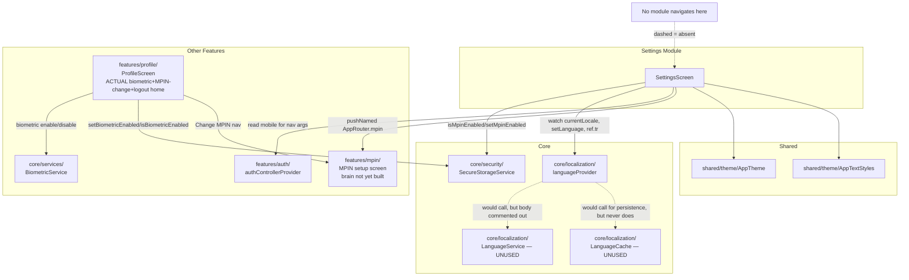

# Cross-Module Map — Settings

## Dependency Table

| Dependency | Type | Used for | File:line |
|---|---|---|---|
| `core/security/secure_storage_service.dart` (`SecureStorageService`) | Core service | Read/write the MPIN-enabled flag (`isMpinEnabled`/`setMpinEnabled`) | `settings_screen.dart:6,30,57` |
| `core/localization/language_provider.dart` (`languageProvider`, `LocalizationHelper.tr`) | Core state | Current locale, language-selector selection, `ref.tr(...)` fallback-only string lookup | `settings_screen.dart:10,78,86,107,123,186-188` |
| `features/auth/controller/auth_controller.dart` (`authControllerProvider`) | Feature (auth) | Reads the logged-in user's mobile number to pass to the MPIN-setup screen | `settings_screen.dart:5,42-43` |
| `routes/app_router.dart` (`AppRouter`) | Routing | `AppRouter.mpin` navigation target for MPIN setup | `settings_screen.dart:7,49` |
| `shared/theme/app_theme.dart` (`AppTheme.arcticBlue`) | Shared theme | Accent color throughout | `settings_screen.dart:8` (multiple uses) |
| `shared/theme/app_text_styles.dart` (`AppTextStyles.titleLarge`) | Shared theme | AppBar title style | `settings_screen.dart:9,146` |

**Explicitly NOT a dependency** (despite the task brief's assumption and `config.md`'s module-registry
description): `core/services/biometric_service.dart`. Grep-confirmed zero references in
`settings_screen.dart`. See `BUSINESS_RULES.md` RULE-SETTINGS-008.

## Inbound Dependents (who calls into this module)

**None found.** No other module navigates to `AppRouter.settings` / `/settings` (full-tree grep, see
`BUSINESS_RULES.md` RULE-SETTINGS-007). `app_router.dart:178` is the only reference outside the module's
own file (the route-table registration itself).

## Overlap with `features/profile/`

The functionality a user actually reaches for "settings"-type actions lives in
`features/profile/profile_screen.dart`'s "Account" section, not in this module:

| Capability | `Settings` module | `Profile` module (actual live path) |
|---|---|---|
| MPIN enable/disable | `_toggleMpin()`, `settings_screen.dart:39-60` — switch-based, no re-auth to disable | `profile_screen.dart` has "Change MPIN" (navigates to `AppRouter.changeMpin`, `profile_screen.dart:319-324`) — a *change* flow, not an enable/disable switch; the two screens model MPIN control differently |
| Biometric toggle | Not present | `profile_screen.dart:303-315`, backed by `core/services/biometric_service.dart` + `SecureStorageService.isBiometricEnabled/setBiometricEnabled`, with a 3-guard flow (device check → MPIN re-verify → biometric confirm, `profile_screen.dart:56-99`) |
| Logout | Not present | `profile_screen.dart:327-330` |
| Delete account | Not present | `profile_screen.dart:331-336` |
| Language | `_showLanguageSelector()`, `settings_screen.dart:62-127` | Not present in Profile |
| Push notifications | Dead tile, `settings_screen.dart:174-181` | Not present in Profile (see `features/notifications/` module, separate from both — inbox, not a preference toggle) |
| Dark mode | Dead tile, `settings_screen.dart:194-201` | Not present anywhere in the app (no live dark theme wiring at all, see `BUSINESS_RULES.md` RULE-SETTINGS-006) |

This is a genuine functional split/duplication, not just cosmetic — Settings' MPIN control and Profile's
biometric+MPIN-change controls both write to the same `SecureStorageService` keys
(`is_mpin_enabled`, `is_biometric_enabled`) but via different UI flows with different safeguards (e.g.
Profile's biometric-disable path does not appear to force re-auth either — **unconfirmed**, not
re-verified line-by-line as part of this Settings-focused round; Profile's own brain should confirm when
built).

## Mermaid Dependency Graph

## Known Violations of `AGENTS.md` Conventions

- **Duplicate/conflicting ownership of MPIN and biometric state** between this module and `Profile` —
  `AGENTS.md` §1 says cross-feature reuse should go through `shared/`/`core/`, which both modules do
  correctly for the *storage* layer (`SecureStorageService`), but the *UI* and *flow safeguards* around
  that shared state are independently reimplemented in two places with different behavior. Worth a
  design decision (consolidate into one screen, or clearly separate their purposes) rather than a code
  fix — flagged for `_SYSTEM` synthesis.
- **Two fully dead classes** (`LanguageCache`, `LanguageService`) sitting in `core/localization/` — not a
  Settings-module violation per se (they're Core-owned), but discovered while tracing this module's
  language-switching flow; worth flagging to whoever builds the `Core` brain.
