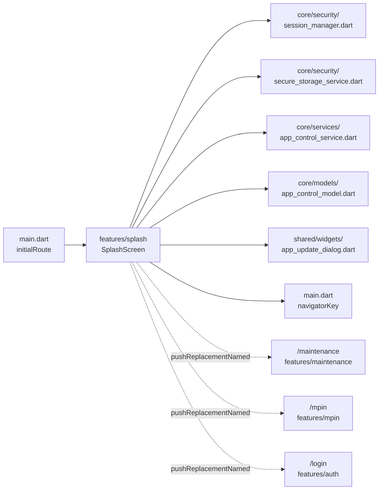

# Splash — Cross-Module Map

## Outbound dependencies (what `splash` reads from)

| Dependency | File | Used for |
|---|---|---|
| `SessionManager` | `core/security/session_manager.dart` | `isAuthenticated()` |
| `SecureStorageService` | `core/security/secure_storage_service.dart` | `isMpinEnabled()` |
| `AppControlService` | `core/services/app_control_service.dart` | `fetchAppControl()` — instantiated directly, **not** via the `appControlProvider` Riverpod provider that the rest of the app uses |
| `AppControlData` / `AppVersionInfo` / `MaintenanceInfo` | `core/models/app_control_model.dart` | parsing the `app/control` response |
| `AppRouter` | `routes/app_router.dart` | route constants (`login`, `mpin`, `maintenance`) |
| `navigatorKey` | `main.dart` (exported global) | obtaining a `BuildContext` with a `Navigator` ancestor for the update dialog |
| `AppUpdateDialog` | `shared/widgets/app_update_dialog.dart` | blocking version-update UI |
| `shared_preferences` (package) | — | caching the raw `app/control` JSON for offline version re-checks |
| `package_info_plus` (package) | — | reading the installed app version |

## Inbound dependencies (what depends on `splash`)

| Consumer | Relationship |
|---|---|
| `main.dart:96` | `initialRoute: AppRouter.splash` — the only entry point; nothing else navigates *to* `/splash` |
| `routes/app_router.dart:129` | route registration |

No other feature module imports anything from `lib/features/splash/`.

## Known route hand-offs

- `splash` → `AppRouter.maintenance` with `arguments: {'resumeRoute': <login|mpin>}` — see
  `Maintenance/CROSS_MODULE_MAP.md` for the other two call sites that push this same route.
- `splash` → `AppRouter.mpin` (module: `mpin`, not yet brained).
- `splash` → `AppRouter.login` (module: `auth`, not yet brained).
- `splash` stays on `/splash` and shows `AppUpdateDialog` (module: `shared/widgets`) instead of
  navigating when an update is required.

## Mermaid

## Known architecture deviation

`AppControlService()` is instantiated directly instead of going through the shared
`appControlProvider` (`core/providers/app_control_provider.dart`) that `AppControlWrapper` and
`MaintenanceGate` use. This means splash's app-control fetch and the app-wide
`AppControlNotifier`'s own fetch (triggered separately by `AppControlWrapper.initState`,
`shared/widgets/app_control_wrapper.dart:35-37`) are two independent network calls at startup.
Not a bug — the provider tree isn't guaranteed built yet when splash runs — but a real duplication
worth knowing about before changing either call site.
