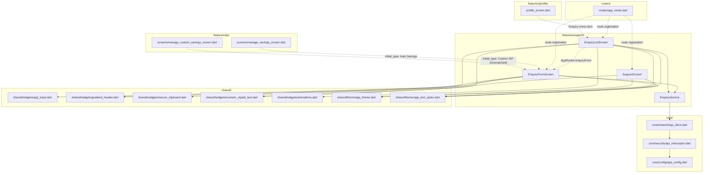

# Support — Cross-Module Map

## Dependency Graph

## Inbound Dependencies (who depends on Support)

| Caller | What it uses | File:Line |
|---|---|---|
| `features/sip/screens/manage_savings_screen.dart` | `AppRouter.enquiryForm` w/ `initial_type: 'Auto Savings'` | `manage_savings_screen.dart:232-238` |
| `features/sip/screens/manage_custom_savings_screen.dart` | `AppRouter.enquiryForm` w/ `initial_type: 'Custom SIP'` | `manage_custom_savings_screen.dart:222-227` |
| `features/profile/profile_screen.dart` | `AppRouter.enquiryList` (side-menu "Enquiry" item) | `profile_screen.dart:285-290` |
| `routes/app_router.dart` | Route registration for all 3 Support screens | `app_router.dart:176, 275-283` |

## Outbound Dependencies (what Support depends on)

| Dependency | Purpose |
|---|---|
| `core/network/api_client.dart` (`ApiClient`) | All HTTP — `support/create-ticket`, `support/list` |
| `core/security/api_interceptor.dart` (indirect, via `ApiClient`) | Bearer token attach, encryption gate (not triggered here — `support/*` not in `encryptedEndpoints`) |
| `shared/widgets/app_toast.dart` | Success/error toasts on submit |
| `shared/widgets/gradient_header.dart` | Header UI on both form and list screens |
| `shared/widgets/secure_clipboard.dart` | `contextMenuBuilder: SecureClipboard.none` on form text fields (disables copy/paste context menu) |
| `shared/widgets/numeric_styled_text.dart` | Font-family switching for numeric substrings (ticket id, FAQ text) |
| `shared/widgets/animations.dart` (`FadeInAnimation`) | Staggered list-item entrance in `EnquiryListScreen` |
| `shared/theme/{app_theme,app_text_styles}.dart` | Color/typography constants |
| `routes/app_router.dart` | Route constants + `initial_type` argument decoding |

## Known Layering Violations

None found. Support does not reach into other features' internals; other features reach Support only
through the public route (`Navigator.pushNamed(AppRouter.enquiryForm/enquiryList, ...)`), consistent with
`AGENTS.md` §1's feature-isolation rule.

## Notes for `_SYSTEM/MODULE_DEPENDENCIES.md` synthesis

- Support is a **leaf module** — nothing inside `core/` or other features imports from
  `features/support/`; it is purely a navigation target.
- The `initial_type` argument contract (`Map<String,dynamic>{'initial_type': String}`) is an informal,
  string-based cross-module protocol with no shared constant/enum — any new caller must know the exact
  `kTicketTypes` label strings by convention, not by compiler-checked type. This is the root cause of
  RULE-SUPPORT-004's bug and worth flagging as a systemic pattern if other modules do the same thing.
