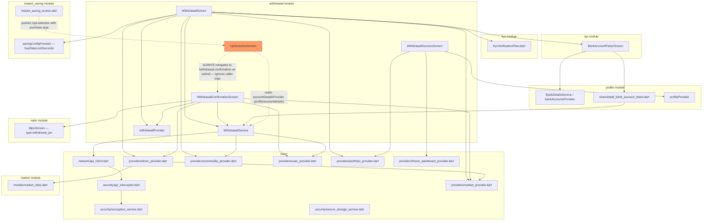

# Cross-Module Map — Withdrawal

## Dependency Graph

## Dependencies (What Withdrawal Reads From)

| Module/Layer | What's used | File |
|---|---|---|
| `core/network` | `ApiClient` (Dio) — all API calls | `core/network/api_client.dart` |
| `core/security` | `ApiSecurityInterceptor` (RSA field encryption, session/401/409 handling) — transparent, not called directly | `core/security/api_interceptor.dart` |
| `core/providers` | `timer_provider.dart` (`buyRateTimerProvider`, shared with InstantSaving), `market_provider.dart` (`marketRatesStreamProvider`, `marketStatusProvider`), `commodity_provider.dart` (`commodityProvider`, `selectedMetalIdProvider`), `user_provider.dart` (`userProvider`), `portfolio_provider.dart` (`portfolioProvider`, used only for the first-load skeleton gate), `home_dashboard_provider.dart` (invalidated post-success) | `core/providers/*` |
| `kyc` module | `KycVerificationFlow.start(requestFrom: 'withdraw')` — cross-feature import (`kyc/kyc_flow.dart`) | `withdrawal_screen.dart:1125` |
| `mpin` module | `AppRouter.mpin` route with `type: 'withdrawal_pin'` argument — navigation-only coupling, no direct import of mpin internals | `withdrawal_confirmation_screen.dart:464-468` |
| `sip` module | `BankAccountPickerScreen` — **direct cross-feature widget import**, violates the "cross-feature reuse goes through `lib/shared/`" convention in `AGENTS.md` §1 (this widget lives under `features/sip/screens/`, not `shared/`, yet is imported and used by `withdrawal`) | `withdrawal_screen.dart:21` (`import '../../sip/screens/bank_account_picker_screen.dart'`) |
| `profile` module | `BankDetailsService`/`bankAccountsProvider` (via `BankAccountPickerScreen`), `BankAccount` model — imported directly (`import '../../profile/models/bank_account.dart'`) | `withdrawal_screen.dart:20` |
| `instant_saving` module | `savingConfigProvider`/`SavingConfig.buyRateLockSeconds` — **withdrawal has no rate-lock-duration config of its own**; it borrows InstantSaving's `savings/config` value | `withdrawal_screen.dart:13-14`, `withdrawal_confirmation_screen.dart:9-10` |
| `market` module | `MarketRates` model (`goldBuy`/`silverBuy`/etc.) | `market/models/market_rates.dart`, imported by `withdrawal_screen.dart:23` |
| `shared/widgets` | `numeric_styled_text.dart`, `loaders.dart`, `app_toast.dart`, `custom_button.dart`, `secure_clipboard.dart`, `gradient_header.dart`, `animations.dart`, `add_bank_account_sheet.dart` | `shared/widgets/*` |
| `shared/utils`/`theme` | `no_leading_zeros_formatter.dart`, `app_text_styles.dart`, `app_theme.dart` | `shared/*` |
| `core/constants` | `AppConstants` (min/max grams, error strings, `confirmWithdrawal` label) | `core/constants/app_constants.dart` |

## Reverse Dependency (What Depends on Withdrawal)

| Module | What it uses | File |
|---|---|---|
| `instant_saving` | Navigates to `AppRouter.upiSelection` (`UpiSelectionScreen`, physically owned by `withdrawal`) as its `UPI_LIST` purchase-payment step | `instant_saving/instant_saving_screen.dart:1654` |
| `home` | Entry point navigation to `AppRouter.withdrawal` | `home/home_screen.dart:848,1417` |
| `shared/widgets/add_bank_account_sheet.dart` | Imports `WithdrawalService` directly for `verifyAndAddBank` — the shared bank-add sheet is coupled to a feature-module service rather than a `core`/`shared` service | `shared/widgets/add_bank_account_sheet.dart:8` |

## Known Architecture Violations (per `AGENTS.md` §1)

1. **`withdrawal` → `sip` direct feature-to-feature import** (`BankAccountPickerScreen`). Per house rule,
   cross-feature reuse should go through `lib/shared/` or `lib/core/`; this widget lives in `sip`'s own
   `screens/` folder yet is treated as shared infrastructure by both `sip` and `withdrawal`. Candidate for
   promotion to `lib/shared/widgets/` in a future refactor — recording here rather than silently accepting it
   as intended.
2. **`shared/widgets/add_bank_account_sheet.dart` → `withdrawal` feature import** (`WithdrawalService`). A
   `shared/` widget reaching into a specific feature's service layer inverts the intended dependency
   direction (`shared/`/`core/` should be depended on, not depend on features).
3. **`UpiSelectionScreen` ownership mismatch** — the file lives under `withdrawal/screens/` but its only live
   caller is `instant_saving`, and its own submit action hardcodes navigation back into `withdrawal`'s
   confirmation screen regardless of the caller's context (see `MODULE_BRAIN.md` Top Risk #1,
   `FORENSIC_TEMPLATE.md`). This is the most consequential violation found — it's not just a layering
   nit, it's a plausible functional bug at the module boundary.

## `_SYSTEM` Synthesis Candidates

- `MODULE_DEPENDENCIES.md` (when built): register `withdrawal ⇄ sip` (BankAccountPickerScreen),
  `withdrawal ⇄ instant_saving` (savingConfigProvider, UpiSelectionScreen), `withdrawal ⇄ profile`
  (bank accounts), `withdrawal ⇄ kyc`, `withdrawal ⇄ mpin` as confirmed edges.
- `DANGER_ZONES.md` candidate: "Do not assume `UpiSelectionScreen`'s submit action respects caller context —
  it always routes to Withdrawal Confirmation."
