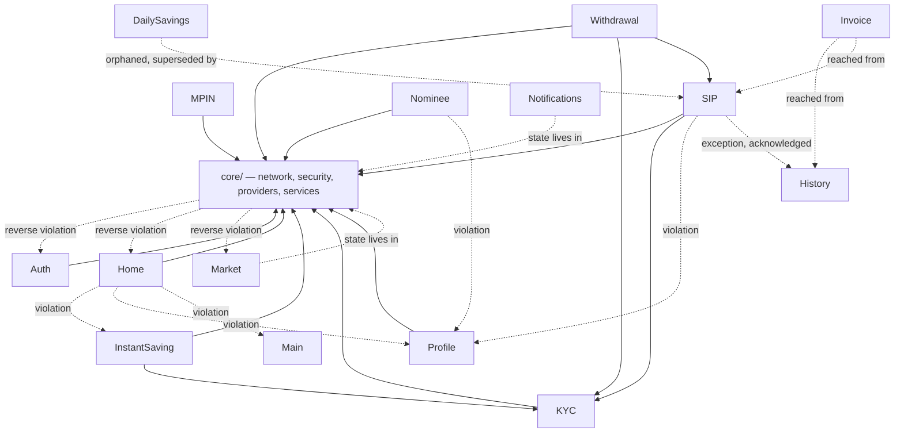

# Module Dependencies

## Core → Features (intended direction)

Every feature depends on `core/` for network, security, and shared providers. Confirmed heaviest
consumers: `Home` (10+ core provider/service imports — timer, market, home-dashboard, portfolio,
commodity, countdown-offer, user, plus 3 core services), `Auth`/`MPIN`/`KYC`/`Withdrawal` (security +
encryption stack), `Notifications` (its entire state/model/service layer *lives in* `core/`, a deliberate
exception documented below).

## Reverse dependencies (Features → Core) — layering violations

`core/providers/*` importing feature internals (4 confirmed): reaches into `features/auth/controller/`,
`features/home/models/`, `features/market/models/`. `core/` should depend on nothing under `features/` —
see `_SYSTEM/DANGER_ZONES.md` DZ-006.

## Feature → Feature (should route through Core/Shared, mostly doesn't)

| From | To | What | Status |
|---|---|---|---|
| Home | InstantSaving | `saving_controller.dart` | Violation — direct controller import |
| Home | Profile | `profile_controller.dart` | Violation — direct controller import |
| Home | Main | `main_screen.dart` | Violation — direct import |
| Nominee | Profile | `profile_controller.dart` (pincode lookup) | Violation |
| KYC | Profile | `profile_controller.dart` (via `kyc_flow.dart`) | Violation |
| SIP | Profile | `bankAccountsProvider`/`BankAccount` model | Violation |
| SIP | History | `TransactionDetailResponse` model | Acknowledged exception (code comment explains it) |
| Invoice | History / SIP | called FROM these two, not the reverse | Intended — Invoice is a shared downstream viewer |

Full remediation notes live in each module's own `CROSS_MODULE_MAP.md` "Known Violations" section.

## Intentional Cross-Cutting Exceptions (not violations)

- **Notifications**: entire model/state/service layer lives in `core/services/notification_service.dart` +
  `fcm_service.dart` rather than `features/notifications/`, specifically so `Home` can watch the unread
  badge count without importing a feature-internal path. Documented as the accepted pattern.
- **Market**: `features/market/` is a single model file; the real live-rate architecture (socket, providers,
  timers) lives entirely in `core/`. Same rationale as Notifications.
- **SIP ↔ History**: SIP has its own transaction-history screen/controller/endpoint but explicitly reuses
  History's `TransactionItem`/`HistoryResponse`/`FilterOption` models — a narrow, one-directional,
  code-comment-acknowledged exception.

## KYC-Gating Dependency (cross-cutting business logic, not a code import)

`InstantSaving`, `Withdrawal`, and `SIP` all gate on KYC completion via the shared
`POST savings/check-eligibility` endpoint's `next_step` field (`'KYC_REQUIRED'` vs `'PAYMENT'`). SIP
additionally does a proactive client-side check against cached `user.kycStatus == 1` before even reaching
payment steps. All three route through the single `KycVerificationFlow.start(context, ref, requestFrom:
'instant'|'withdraw'|'sip')` entry point in `kyc_flow.dart`, which best-effort refreshes `profileProvider`
on completion. `user.kycStatus` itself lives on Profile's User model, sourced from the profile API's
`kyc_status` field.

## Payment-Gateway Dependency (cross-cutting, server-selected)

`InstantSaving`, `SIP`, and (implicitly) `Withdrawal`'s payout flow all integrate with a gateway selected
server-side per request (`payment_gateway` field in the initiate/create response), not a fixed client
choice. Three gateways confirmed live across the app: Cashfree, HDFC SmartGateway (via Juspay HyperSDK),
Razorpay. `InstantSaving`'s legacy `payment_methods_screen.dart` (Cashfree/Razorpay only, no HDFC) is dead
code — see `_SYSTEM/DEAD_CODE_AND_ORPHANED_ROUTES.md`.

## Mermaid — High-Level Module Graph

