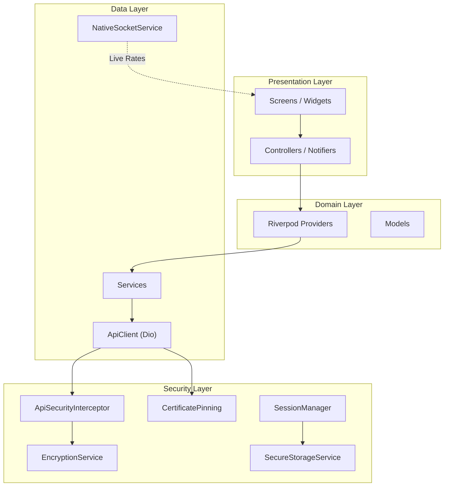
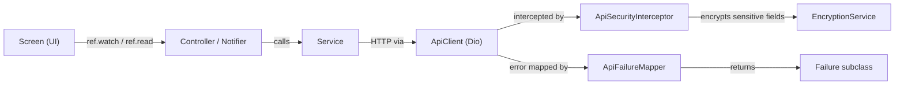
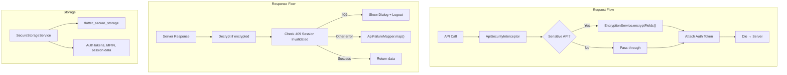
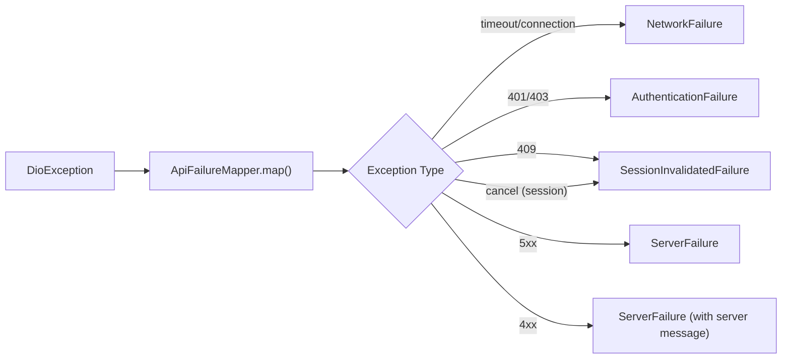
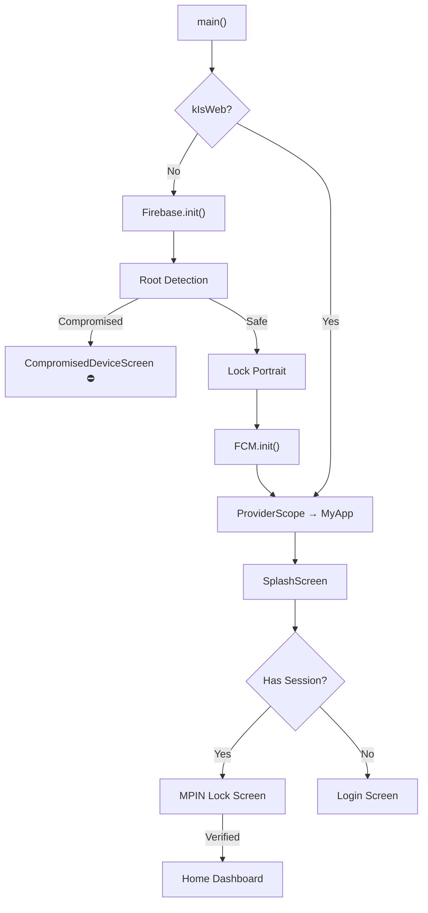
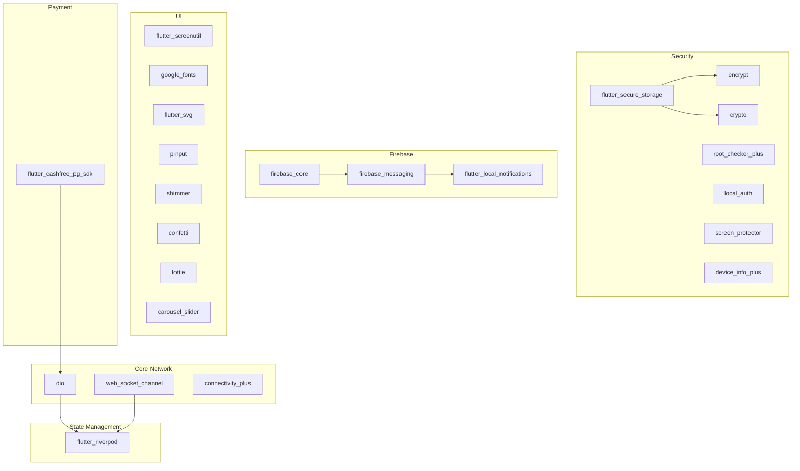

# StartGOLD — Project Architecture

## Overview

**StartGOLD** is a fintech Flutter mobile app for gold/silver investment — supporting instant savings, SIP plans, KYC, withdrawals, and live market rates. It follows a **Feature-first + Clean Architecture hybrid** pattern with **Riverpod** for state management.

| Attribute | Detail |
|-----------|--------|
| **Framework** | Flutter (Dart) |
| **State Management** | `flutter_riverpod` (`StateNotifier` + `StateNotifierProvider`) |
| **Networking** | Dio with interceptors |
| **Encryption** | AES-256 (sensitive fields) + RSA (key exchange) |
| **Auth** | OTP-based login → MPIN lock → Biometric |
| **Push Notifications** | Firebase Cloud Messaging (FCM) |
| **Live Rates** | WebSocket (Socket.IO) |
| **Localization** | English, Tamil, Telugu |
| **Design Size** | 390×844 (iPhone 14 baseline) via `flutter_screenutil` |

---

## High-Level Architecture



---

## Directory Structure

```
lib/
├── main.dart                          # App entry point
├── core/                              # Cross-cutting infrastructure
│   ├── config/
│   │   └── app_config.dart            # Base URL, timeouts, endpoints
│   ├── constants/                     # App-wide constants
│   ├── error/
│   │   └── failures.dart              # Failure types + ApiFailureMapper
│   ├── localization/
│   │   ├── language_provider.dart     # Locale state (en/ta/te)
│   │   ├── language_service.dart      # Translation loader
│   │   └── language_cache.dart        # Cached locale preference
│   ├── models/
│   │   └── app_control_model.dart     # Force-update / maintenance model
│   ├── network/
│   │   ├── api_client.dart            # Dio wrapper (GET/POST)
│   │   ├── interceptors.dart          # Logging/auth interceptors
│   │   └── native_socket_service.dart # WebSocket for live metal rates
│   ├── providers/                     # Global Riverpod providers
│   │   ├── user_provider.dart         # Current user session
│   │   ├── app_control_provider.dart  # Force-update, maintenance gate
│   │   ├── connectivity_provider.dart # Online/offline detection
│   │   ├── commodity_provider.dart    # Gold/silver commodity data
│   │   ├── market_provider.dart       # Live market rates state
│   │   ├── portfolio_provider.dart    # User portfolio state
│   │   ├── home_dashboard_provider.dart
│   │   └── timer_provider.dart        # Rate refresh timer
│   ├── security/                      # Fintech-grade security layer
│   │   ├── api_interceptor.dart       # Token attach, retry, RSA key fetch
│   │   ├── encryption_service.dart    # AES-256 + RSA encryption/decryption
│   │   ├── certificate_pinning.dart   # SSL pin validation
│   │   ├── secure_storage_service.dart# flutter_secure_storage wrapper
│   │   ├── session_manager.dart       # Token lifecycle management
│   │   ├── secure_logger.dart         # Scrubs sensitive fields from logs
│   │   ├── app_lifecycle_observer.dart # Idle timeout, background lock
│   │   └── root_detection_service.dart # Jailbreak/root check
│   ├── services/                      # Core business services
│   │   ├── auth_service.dart          # Login, OTP, registration
│   │   ├── mpin_service.dart          # MPIN set/verify/forgot
│   │   ├── biometric_service.dart     # Fingerprint/FaceID
│   │   ├── fcm_service.dart           # Push notification handling
│   │   ├── notification_service.dart  # Notification CRUD
│   │   ├── home_service.dart          # Dashboard data
│   │   ├── portfolio_service.dart     # Portfolio API calls
│   │   ├── shared_service.dart        # Pincode check, common APIs
│   │   ├── content_service.dart       # CMS/content fetching
│   │   ├── device_id_service.dart     # Unique device fingerprint
│   │   ├── device_service.dart        # Device info
│   │   └── app_control_service.dart   # Version check / maintenance
│   └── utils/
│       ├── masking_utils.dart         # PII masking (phone, aadhaar)
│       ├── kyc_validator.dart         # KYC field validation
│       ├── navigation_utils.dart      # Navigation helpers
│       ├── validators.dart            # Generic input validators
│       └── logger.dart                # Dev-mode logger
│
├── features/                          # Feature modules (21 modules)
│   ├── auth/                          # Authentication flow
│   │   ├── controller/               # Auth state notifier
│   │   ├── login/                     # Login screen
│   │   ├── otp/                       # OTP verification screen
│   │   ├── pin/                       # PIN setup screen
│   │   └── registration/             # New user registration
│   ├── mpin/                          # App lock (MPIN + biometric)
│   ├── splash/                        # Splash + session routing
│   ├── onboarding/                    # First-time user walkthrough
│   ├── main/                          # Bottom nav shell
│   ├── home/                          # Dashboard
│   │   ├── home_screen.dart
│   │   ├── models/
│   │   └── widgets/
│   ├── market/                        # Live gold/silver rates
│   │   └── models/
│   ├── instant_saving/                # One-time gold purchase
│   │   ├── controller/
│   │   ├── models/
│   │   ├── services/
│   │   ├── screens/
│   │   └── payment_handler.dart       # Payment SDK orchestration
│   ├── sip/                           # Systematic Investment Plans
│   │   ├── controller/
│   │   ├── models/
│   │   ├── services/
│   │   ├── screens/
│   │   └── widgets/
│   ├── daily_savings/                 # Daily micro-saving
│   ├── profile/                       # User profile management
│   │   ├── profile_controller.dart
│   │   ├── profile_screen.dart
│   │   ├── account_details_screen.dart
│   │   ├── services/
│   │   ├── screens/
│   │   └── widgets/
│   ├── kyc/                           # KYC verification
│   │   ├── controllers/
│   │   ├── models/
│   │   ├── providers/
│   │   ├── repositories/
│   │   └── screens/
│   ├── withdrawal/                    # Gold/cash withdrawal
│   │   ├── models/
│   │   ├── providers/
│   │   ├── services/
│   │   └── screens/
│   ├── history/                       # Transaction history
│   ├── notifications/                 # In-app notifications
│   ├── nominee/                       # Nominee management
│   ├── referral/                      # Referral program
│   ├── settings/                      # App settings
│   ├── support/                       # Help & support
│   ├── content/                       # CMS content pages
│   └── maintenance/                   # Maintenance mode screen
│
├── routes/
│   └── app_router.dart                # Centralized named-route definitions
│
└── shared/                            # Shared UI layer
    ├── theme/
    │   ├── app_theme.dart             # Colors, gradients, ThemeData
    │   └── app_text_styles.dart       # Typography system
    ├── utils/
    │   └── upper_case_words_formatter.dart
    └── widgets/
        ├── app_toast.dart             # Global toast notifications
        ├── app_alert_banner.dart      # Alert banners
        ├── app_control_wrapper.dart   # Force-update + maintenance gate
        ├── app_update_dialog.dart     # Update prompt dialog
        ├── session_invalidated_dialog.dart # Session expiry dialog
        ├── custom_button.dart         # Reusable gradient button
        ├── gradient_header.dart       # Screen header with gradient
        ├── loaders.dart               # Loading indicators
        ├── animations.dart            # Shared animations
        ├── numeric_styled_text.dart   # Number formatting widget
        ├── offline_banner.dart        # Connectivity lost banner
        ├── maintenance_gate.dart      # Maintenance mode gate
        └── compromised_device_screen.dart # Rooted device block
```

---

## Layered Architecture



### Layer Responsibilities

| Layer | Role | Example |
|-------|------|---------|
| **Screen** | UI rendering, user interaction | `account_details_screen.dart` |
| **Controller/Notifier** | State management, business logic | `ProfileNotifier` (StateNotifier) |
| **Service** | API calls, data transformation | `ProfileService` |
| **ApiClient** | HTTP abstraction (Dio wrapper) | `ApiClient.post()` |
| **Interceptor** | Auth tokens, encryption, logging | `ApiSecurityInterceptor` |
| **Failure** | Typed error handling | `ServerFailure`, `NetworkFailure` |

---

## State Management — Riverpod

All state is managed via **Riverpod** using this pattern:

```dart
// 1. State class (immutable)
class ProfileState {
  final UserProfile user;
  final bool isLoading;
  final String? error;
  // ...
}

// 2. StateNotifier (business logic)
class ProfileNotifier extends StateNotifier<ProfileState> {
  ProfileNotifier(this._service, this._id) : super(ProfileState(...));
  
  Future<bool> updateProfile({...}) async {
    state = state.copyWith(isLoading: true);
    final result = await _service.updateProfile(...);
    // update state based on result
  }
}

// 3. Provider (DI + wiring)
final profileProvider = StateNotifierProvider<ProfileNotifier, ProfileState>((ref) {
  final service = ref.watch(profileServiceProvider);
  final user = ref.watch(userProvider);
  return ProfileNotifier(service, user?.id ?? '');
});

// 4. UI consumption
class MyScreen extends ConsumerWidget {
  Widget build(BuildContext context, WidgetRef ref) {
    final state = ref.watch(profileProvider);       // reactive rebuild
    ref.read(profileProvider.notifier).doSomething(); // fire action
  }
}
```

### Key Global Providers

| Provider | Purpose |
|----------|---------|
| `userProvider` | Current authenticated user |
| `connectivityProvider` | Online/offline state |
| `appControlProvider` | Force update & maintenance checks |
| `marketProvider` | Live gold/silver rates |
| `commodityProvider` | Commodity metadata |
| `portfolioProvider` | User investment portfolio |
| `languageProvider` | App locale (en/ta/te) |
| `timerProvider` | Rate refresh timer |

---

## Security Architecture



### Security Components

| Component | File | Role |
|-----------|------|------|
| **EncryptionService** | `encryption_service.dart` | AES-256 encrypt/decrypt + RSA public key exchange |
| **ApiSecurityInterceptor** | `api_interceptor.dart` | Token injection, RSA key bootstrap, retry logic |
| **CertificatePinning** | `certificate_pinning.dart` | SSL certificate pin validation |
| **SecureStorageService** | `secure_storage_service.dart` | Encrypted local key-value storage |
| **SessionManager** | `session_manager.dart` | Token lifecycle (store/refresh/clear) |
| **SecureLogger** | `secure_logger.dart` | Scrubs PII (aadhaar, PAN, password) from logs |
| **AppLifecycleObserver** | `app_lifecycle_observer.dart` | Idle timeout → auto-lock with MPIN |
| **RootDetectionService** | `root_detection_service.dart` | Blocks rooted/jailbroken devices |

### Encrypted Fields (per security rules)

| Field | APIs |
|-------|------|
| `password`, `OTP` | `/login`, `/verify-otp`, `/generate-otp` |
| `aadhaar_number`, `pan_number`, `bank_account_number` | `/submit-kyc`, `/update-kyc` |
| `withdrawal_amount`, `upi_id`, `transaction_pin` | `/withdraw` |
| `amount`, `payment_pin`, `bank_details` | `/payment`, `/investment` |

---

## Networking

### ApiClient (Dio Wrapper)

```
ApiClient
├── BaseURL: AppConfig.baseUrl
├── Interceptors:
│   └── ApiSecurityInterceptor (auth, encryption, RSA key)
├── CertificatePinning (HTTPS only)
├── Methods:
│   ├── get(path, queryParams) → Response
│   └── post(path, data) → Response
└── Error Handling:
    ├── DioException → ApiFailureMapper.map(e) → Failure
    └── Other → ServerFailure (generic)
```

### WebSocket (Live Rates)

```
NativeSocketService
├── Endpoint: ws://bullion_v4.logimaxindia.com/ratesocket/socket.io/
├── Events: market_rates, gold_rate, silver_rate
├── Auto-reconnect on failure
└── No sensitive data transmitted
```

---

## Error Handling



| Failure Type | Default Message | When |
|--------------|----------------|------|
| `NetworkFailure` | "Network connection lost" | Timeout, no connection |
| `ServerFailure` | "Server temporarily unavailable" | 5xx or generic errors |
| `AuthenticationFailure` | "Session expired" | 401, 403 |
| `SessionInvalidatedFailure` | "Session invalidated" | 409 Conflict |
| `InvalidResponseFailure` | "Invalid response from server" | Cancelled/malformed |

> **Key:** `ApiFailureMapper` always tries to extract the real `message` from the API response body before falling back to generic strings.

---

## Navigation

- **Centralized** in `routes/app_router.dart` using `onGenerateRoute`
- **Named routes** throughout (e.g., `AppRouter.splash`, `AppRouter.home`)
- **Global navigator key** for dialogs from anywhere (session invalidation)
- **PopScope** used on security-critical flows (MPIN lock, forgot PIN) to block back navigation

---

## App Startup Flow



---

## Feature Modules (21)

| Module | Description | Internal Structure |
|--------|-------------|-------------------|
| **auth** | Login, OTP, registration, PIN setup | controller/, login/, otp/, pin/, registration/ |
| **mpin** | App lock with MPIN + biometric | screen + service |
| **splash** | Session check + initial routing | single screen |
| **onboarding** | First-time walkthrough | single screen |
| **main** | Bottom navigation shell | tab wrapper |
| **home** | Dashboard with portfolio summary | models/, widgets/ |
| **market** | Live gold/silver rates | models/ |
| **instant_saving** | One-time gold purchase | controller/, models/, services/, screens/, payment_handler |
| **sip** | Systematic Investment Plans | controller/, models/, services/, screens/, widgets/ |
| **daily_savings** | Daily micro-investment | single screen |
| **profile** | Account details, photo upload | controller, services/, screens/, widgets/ |
| **kyc** | KYC verification (Aadhaar/PAN) | controllers/, models/, providers/, repositories/, screens/ |
| **withdrawal** | Gold/cash withdrawal | models/, providers/, services/, screens/ |
| **history** | Transaction history list | screens |
| **notifications** | In-app notifications | screens |
| **nominee** | Nominee CRUD | screens |
| **referral** | Referral program | screens |
| **settings** | App preferences | screens |
| **support** | Help & customer support | screens |
| **content** | CMS pages (T&C, FAQs, etc.) | screens |
| **maintenance** | Maintenance mode screen | single screen |

---

## Dependencies & Packages

> **Dart SDK:** `>=3.4.1 <4.0.0` | **App Version:** `1.0.0+7`

### Core Logic & Network

| Package | Version | Purpose | Used In |
|---------|---------|---------|---------|
| `flutter` | SDK | Core Flutter framework | Entire app |
| `flutter_localizations` | SDK | Material/Cupertino locale support for Tamil, Telugu, English | `main.dart` — `localizationsDelegates` |
| `cupertino_icons` | ^1.0.6 | iOS-style icons (`CupertinoIcons`) | Various UI screens |
| `intl` | 0.20.2 | Date/number formatting, internationalization utilities | Date display, currency formatting |
| `dio` | ^5.4.1 | HTTP client with interceptor support (replaces `http` package) | `core/network/api_client.dart` — all API calls |
| `flutter_riverpod` | ^2.4.9 | State management — `StateNotifier`, `Provider`, `ConsumerWidget` | Every feature controller + provider |
| `shared_preferences` | ^2.5.2 | Lightweight local key-value storage (non-sensitive data) | Language preference cache, onboarding flag |
| `package_info_plus` | ^9.0.0 | Reads app version/build number at runtime | `app_control_service.dart` — force-update version comparison |
| `connectivity_plus` | ^7.0.0 | Detects network connectivity state (WiFi/mobile/none) | `core/providers/connectivity_provider.dart` — offline banner |
| `web_socket_channel` | ^3.0.3 | WebSocket client for persistent connections | `core/network/native_socket_service.dart` — live gold/silver rates |

### Firebase & Push Notifications

| Package | Version | Purpose | Used In |
|---------|---------|---------|---------|
| `firebase_core` | ^3.6.0 | Firebase initialization (required for all Firebase services) | `main.dart` — `Firebase.initializeApp()` |
| `firebase_messaging` | ^15.1.3 | Firebase Cloud Messaging — receives push notification tokens & background messages | `core/services/fcm_service.dart` |
| `flutter_local_notifications` | ^17.2.2 | Shows local notification banners when app is in foreground (FCM doesn't do this natively) | `core/services/fcm_service.dart` — foreground notification display |

### Security & Identity

| Package | Version | Purpose | Used In |
|---------|---------|---------|---------|
| `flutter_secure_storage` | ^9.0.0 | Encrypted key-value storage (Keychain on iOS, EncryptedSharedPreferences on Android) | `core/security/secure_storage_service.dart` — auth tokens, MPIN hash, session data |
| `root_checker_plus` | ^0.0.3 | Detects rooted (Android) / jailbroken (iOS) devices | `core/security/root_detection_service.dart` — blocks compromised devices at startup |
| `device_info_plus` | ^10.1.0 | Reads device model, OS version, unique identifiers | `core/services/device_id_service.dart` — device fingerprint for API headers |
| `screen_protector` | ^1.5.1 | Prevents screenshots & screen recording in sensitive flows | Security-critical screens (payment, KYC) |
| `local_auth` | ^3.0.1 | Biometric authentication (fingerprint / FaceID) | `core/services/biometric_service.dart` — MPIN screen biometric unlock |
| `crypto` | ^3.0.3 | Hashing utilities (SHA-256, HMAC) | `core/security/encryption_service.dart` — key derivation, hash verification |
| `encrypt` | ^5.0.3 | AES-256 & RSA encryption/decryption | `core/security/encryption_service.dart` — encrypts sensitive API fields (password, aadhaar, PAN, etc.) |

### UI & Design

| Package | Version | Purpose | Used In |
|---------|---------|---------|---------|
| `flutter_screenutil` | ^5.8.4 | Responsive sizing — scales `sp`, `w`, `h`, `r` units to design size (390×844) | Every screen — ensures consistent sizing across devices |
| `google_fonts` | ^6.1.0 | Runtime Google Fonts loading (Playfair Display, Lora, etc.) | `shared/theme/app_text_styles.dart` — app-wide typography |
| `flutter_svg` | ^2.0.9 | Renders SVG vector assets | Icons, button icons (`assets/buttons/*.svg`), illustrations |
| `carousel_slider` | ^5.0.0 | Horizontal swipeable carousel widget | Onboarding screens, home dashboard banners |
| `pinput` | ^5.0.0 | Customizable PIN input field (styled OTP/MPIN boxes) | `features/mpin/`, `features/auth/otp/`, `features/auth/pin/` |
| `shimmer` | ^3.0.0 | Shimmer loading placeholder animation | Skeleton loading states across screens |
| `confetti` | ^0.8.0 | Confetti celebration animation | Success states (payment complete, KYC approved) |
| `lottie` | ^3.3.1 | Lottie JSON animation player | Splash screen, loading animations, success/error states |

### Media & Files

| Package | Version | Purpose | Used In |
|---------|---------|---------|---------|
| `image_picker` | ^1.2.1 | Pick images from camera or gallery | `features/profile/widgets/` — profile photo selection |
| `image_cropper` | ^11.0.0 | Crop/resize picked images before upload | `features/profile/widgets/` — profile photo cropping |
| `path_provider` | ^2.1.5 | Access platform-specific directories (temp, documents, cache) | File downloads, image caching |
| `path` | ^1.9.1 | Cross-platform file path manipulation | File name extraction, extension parsing |
| `url_launcher` | ^6.3.2 | Opens URLs in external browser, phone dialer, email client | Support screen (call, email), T&C links, payment redirects |
| `share_plus` | ^10.0.3 | Native share sheet for text/links/files | `features/referral/` — share referral link |

### Payment

| Package | Version | Purpose | Used In |
|---------|---------|---------|---------|
| `flutter_cashfree_pg_sdk` | 2.3.3+50 | Cashfree payment gateway SDK — handles UPI, cards, net banking | `features/instant_saving/payment_handler.dart` — payment orchestration |

### Content Rendering

| Package | Version | Purpose | Used In |
|---------|---------|---------|---------|
| `flutter_widget_from_html_core` | ^0.17.2 | Renders HTML content as Flutter widgets | `features/content/` — CMS pages (T&C, privacy policy, FAQs) |

### Build & Splash

| Package | Version | Purpose | Used In |
|---------|---------|---------|---------|
| `flutter_native_splash` | ^2.4.7 | Generates native splash screen (before Flutter engine loads) | `flutter_native_splash.yaml` — native Android/iOS splash configuration |

### Dev Dependencies (not in production build)

| Package | Version | Purpose |
|---------|---------|---------|
| `flutter_test` | SDK | Unit & widget testing framework |
| `flutter_lints` | ^3.0.0 | Dart static analysis lint rules |
| `flutter_launcher_icons` | ^0.14.4 | Generates app launcher icons for Android & iOS from a source image |

### Dependency Architecture Map



---

## Key Design Decisions

1. **Feature-first organization** — each feature is self-contained with its own models, services, controllers, and screens
2. **Riverpod over Bloc** — simpler boilerplate, compile-safe providers, better DI
3. **Services return data, not Failures** — services return `Map`/`bool`/`null`; Failures are thrown from `ApiClient` and caught by controllers
4. **Global security interceptor** — encryption, auth, and logging handled transparently at the Dio level
5. **`AppControlWrapper`** — wraps entire app to gate on force-update and maintenance mode
6. **Session invalidation handled globally** — 409 responses trigger a dialog + forced logout from the interceptor, not individual screens
7. **Cashfree PG pinned to exact version** (`2.3.3+50`) — payment SDK versions are locked to avoid breaking changes in payment flows
8. **`encrypt` + `crypto` dual usage** — `encrypt` handles AES/RSA operations while `crypto` provides hashing (SHA-256) for key derivation
